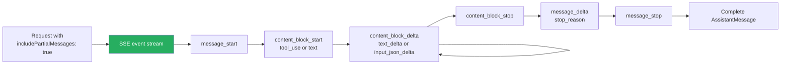

# Streaming API

Set `includePartialMessages: true` to receive raw SSE events instead of waiting for the full response. Use streaming input mode for interactive sessions with image attachments, queued messages, and interrupts.

### Key Concepts



| Event | When | Carries |
|---|---|---|
| `message_start` | Start of response | initial empty message |
| `content_block_start` | Start of a content block | block index + type (`text` / `tool_use`) |
| `content_block_delta` | Streamed delta | `text_delta` or `input_json_delta` |
| `content_block_stop` | End of one block | block index |
| `message_delta` | Top-level updates | final `stop_reason`, output tokens |
| `message_stop` | End of response | terminator |

- **Tool-call streaming** accumulates `input_json_delta` chunks between `content_block_start` (with `tool_use`) and `content_block_stop`
- `StreamEvent` is **not emitted** when `maxThinkingTokens` is set explicitly, and **not** for structured outputs (those land only in `ResultMessage.structured_output`)
- **Streaming input mode** (persistent interactive session) supports image attachments, queued messages, real-time interrupts, hooks, and feedback; single-message mode does not

### How to

```typescript
for await (const message of query({
  prompt: "Explain how databases work",
  options: { includePartialMessages: true }
})) {
  if (message.type === "stream_event") {
    const event = message.event;
    if (event.type === "content_block_delta" && event.delta.type === "text_delta") {
      process.stdout.write(event.delta.text);
    }
  }
}
```

**Streaming input** (multi-turn interactive sessions):

```typescript
async function* generateMessages() {
  yield {
    type: "user" as const,
    message: { role: "user" as const, content: "Analyze for security issues" }
  };
  await new Promise(r => setTimeout(r, 2000));
  yield {
    type: "user" as const,
    message: {
      role: "user" as const,
      content: [
        { type: "text", text: "Review this diagram" },
        { type: "image", source: { type: "base64", media_type: "image/png", data: imgB64 } }
      ]
    }
  };
}

for await (const message of query({
  prompt: generateMessages(),
  options: { maxTurns: 10, allowedTools: ["Read", "Grep"] }
})) { /* ... */ }
```

- For interactive UIs, stream `text_delta` chunks straight to the terminal or websocket
- For tool-call progress UI, count `input_json_delta` chunks but assemble client-side before validating — partial JSON is not parseable
- Use **single-message mode** (string `prompt`, one-shot) only for stateless environments like Lambda
- Use **fine-grained tool streaming** for tools with large inputs (long edit strings, big file contents, lengthy SQL) — streams `tool_use` parameters incrementally for "writing…" UI

### Anti-patterns

- Parsing partial JSON from `input_json_delta` chunks before `content_block_stop` ❌
- Using single-message mode when you need image attachments or interrupts ❌
- Enabling `includePartialMessages` together with `maxThinkingTokens` — `StreamEvent` is suppressed ❌
- Expecting structured outputs to stream — they only appear in the final `ResultMessage.structured_output` ❌
