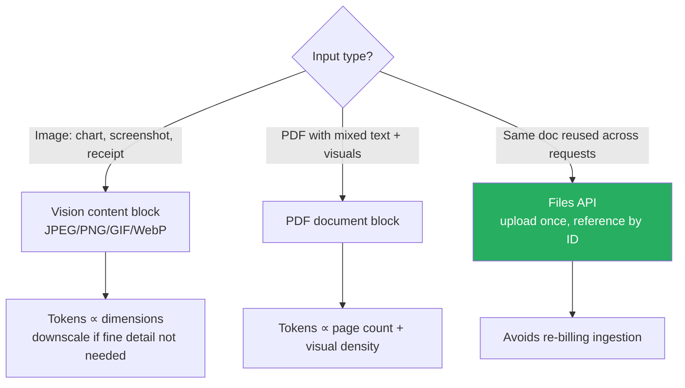

# Vision and PDF Input

Native image and PDF understanding — pass `image` content blocks (JPEG/PNG/GIF/WebP, base64 or URL) or `document` content blocks (PDFs with text + visuals). Token cost scales with image dimensions and PDF page density; use the **Files API** for repeated reads.

### Key Concepts



| Modality | Use for | Watch for |
|---|---|---|
| **Vision** | Chart/diagram reading, screenshot Q&A, OCR-like tasks on receipts and forms, UI bug triage | Tokens proportional to dimensions — downscale if fine detail isn't needed |
| **PDF support** | Research papers, financial filings, contracts with embedded tables, scanned docs with mixed layouts | Page count and visual density drive token cost fast |

- Both modalities pass through the same `content` array — multimodal in one request, multiple images supported
- For repeated reads of the same image or PDF, upload once via the **Files API** and reference by ID; for one-shot inputs, inline base64 is simpler

### How to

**Vision — inline base64:**

```typescript
client.messages.create({
  model: "claude-opus-4-7",
  messages: [{
    role: "user",
    content: [
      { type: "text", text: "What does this UI bug show?" },
      { type: "image",
        source: { type: "base64", media_type: "image/png", data: imgB64 } }
    ]
  }]
});
```

**Vision — by URL:**

```typescript
content: [
  { type: "image",
    source: { type: "url", url: "https://example.com/chart.png" } }
]
```

**PDF — inline:**

```python
client.messages.create(model=M, messages=[{
    "role": "user",
    "content": [
        {"type": "document",
         "source": {"type": "base64",
                    "media_type": "application/pdf",
                    "data": pdf_b64}},
        {"type": "text", "text": "Summarize section 3 and extract all tables."},
    ],
}])
```

**Reused across many requests — Files API:**

```python
file = client.beta.files.upload(
    file=("contract.pdf", pdf_bytes, "application/pdf"))

client.beta.messages.create(model=M, messages=[{
    "role": "user",
    "content": [
        {"type": "document", "source": {"type": "file", "file_id": file.id}},
        {"type": "text", "text": "Summarize section 3."},
    ],
}])
```

- Downscale images you don't need at full resolution (UI screenshots, low-detail charts)
- For PDFs over a few pages, prefer the **Files API** even on first read — uploads deduplicate bytes; combined with prompt caching, avoids both ingestion and token re-billing
- For PDFs with complex layouts, the model sees both extracted text and rendered pages — better than a separate OCR pipeline
- Drag-and-drop or `Ctrl+V` works in Claude Code interactive sessions; for scripted use, base64-encode

### Anti-patterns

- Re-encoding the same PDF inline on every request — switch to Files API as soon as a doc is referenced twice ❌
- Sending full-resolution screenshots when low-detail would do ❌
- Stacking many high-detail images in one request without checking token math ❌
- Running an OCR pipeline upstream when native PDF support handles text + visuals together ❌
- Forgetting to clean up sensitive Files API uploads — they persist server-side until deleted ❌
