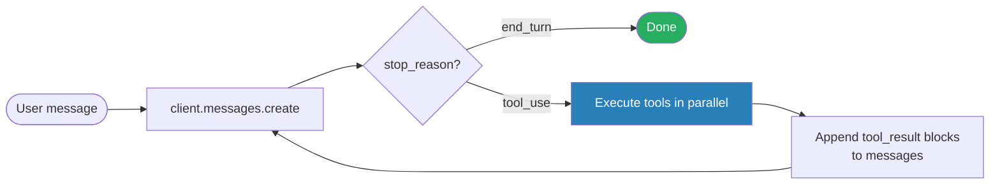

# Agent Loop

Drive an agent by checking `stop_reason` on each turn — continue when it's `"tool_use"`, stop when it's `"end_turn"`. Tool results are appended to the conversation so the model decides the next action from accumulated context.

### Key Concepts



| `stop_reason` | Meaning | Loop action |
|---|---|---|
| `"tool_use"` | Model wants to call one or more tools | Execute, append `tool_result` blocks, send next request |
| `"end_turn"` | Model is done | Exit the loop |
| `"max_tokens"` | Hit output budget | Decide: extend budget, summarize, or escalate |
| `"refusal"` | Model declined | Surface to user; do not retry the same prompt |

#### SDK five-stage loop

The Agent SDK formalizes the loop into five stages:

1. **Receive prompt** — yields `SystemMessage` (`subtype: "init"`) with session metadata
2. **Evaluate and respond** — yields `AssistantMessage` (text + tool calls)
3. **Execute tools** — SDK runs tools, returns results to Claude as `UserMessage`. Hooks intercept here
4. **Repeat** — steps 2–3 until Claude responds without tool calls
5. **Return result** — final `AssistantMessage`, then `ResultMessage` with text, token usage, cost, session ID

A *turn* is one round trip with tool calls. Limit them with `maxTurns` / `max_turns`, or cap spend with `maxBudgetUsd` / `max_budget_usd`.

#### Agent SDK references

```typescript
import { query, type AgentDefinition, type CanUseTool } from "@anthropic-ai/claude-agent-sdk";

// ── AgentDefinition: describes a subagent the coordinator can spawn ──
const codeReviewer: AgentDefinition = {
  description: "Expert reviewer for quality & security.",   // shown in coordinator's tool list
  prompt:      "Analyze code quality and suggest improvements.", // subagent's system prompt
  tools:       ["Read", "Glob", "Grep"],                    // allow-list of tool names
  disallowedTools: ["Bash", "Write"],                       // deny-list; wins over `tools`
  model:       "claude-opus-4-7",                           // override the parent's model
  mcpServers:  [],                                          // MCP servers this subagent may reach
  skills:      ["security-review"],                         // skill IDs from .claude/skills/*
  initialPrompt: "Start by listing changed files.",         // primed first user turn
  maxTurns:    8,                                           // per-subagent turn ceiling
  background:  false,                                       // true → spawn detached
  memory:      "project",                                   // which CLAUDE.md scope to load: user|project|local
  effort:      "high",                                      // thinking-budget hint: low|medium|high|xhigh|max
  permissionMode: "acceptEdits",                            // tool-call gating for this subagent
};

// ── canUseTool: per-call approval callback ──
const canUseTool: CanUseTool = async (toolName, input, ctx) => {
  // ctx.signal — AbortSignal; ctx.toolUseID — matches the assistant's tool_use.id
  if (toolName === "Bash" && /rm -rf/.test(String(input.command))) {
    return { behavior: "deny", message: "destructive command blocked" };
  }
  return { behavior: "allow", updatedInput: input };
};

const q = query({
  prompt: "Review the auth module and report findings.",
  options: {
    // ── Tools ───────────────────────────────────────────────────────────
    allowedTools: ["Read", "Glob", "Grep", "LS", "TodoWrite", "Agent"],
    //   `Agent` (renamed from `Task` in SDK v2.1.63) is required for the
    //     coordinator to spawn subagents declared in `agents`.
    //   `LS` lists directory contents.
    //   `TodoWrite` tracks multi-step progress; payload:
    //     [{ content, activeForm, status: "pending"|"in_progress"|"completed" }].
    disallowedTools: ["WebFetch"],     // hard deny — wins even under `bypassPermissions`
    canUseTool,                         // async approval hook per tool call

    // ── Subagents & MCP ─────────────────────────────────────────────────
    agents:     { "code-reviewer": codeReviewer },
    mcpServers: { playwright: { command: "npx", args: ["@playwright/mcp@latest"] } },

    // ── Permissions & system prompt ─────────────────────────────────────
    permissionMode: "default",
    // one of: "default" | "acceptEdits" | "plan" | "auto" | "dontAsk" | "bypassPermissions"
    systemPrompt: {
      type: "preset",
      preset: "claude_code",
      append: "Be terse.",
      excludeDynamicSections: true,
      // Pulls cwd/OS/date/git-status OUT of the prompt so cache reuse survives
      // across hosts and sessions.
    },

    // ── Loop ceilings (safety nets, NOT primary stops) ──────────────────
    maxTurns:     20,                   // → ResultMessage.subtype "error_max_turns"
    maxBudgetUsd: 5,                    // → ResultMessage.subtype "error_max_budget_usd"
    maxThinkingTokens: 4000,            // setting this SUPPRESSES "stream_event" partials

    // ── Streaming & file checkpointing ─────────────────────────────────
    includePartialMessages: true,       // emit "stream_event" messages
    enableFileCheckpointing: true,
    extraArgs: { "replay-user-messages": null },
    //   The pair above exposes user-message UUIDs that `q.rewindFiles(uuid)`
    //   uses to restore files (NOT conversation) to a prior checkpoint.

    // ── Sessions ───────────────────────────────────────────────────────
    resume:        process.env.SESSION_ID,  // continue a prior session (same cwd required)
    forkSession:   false,                   // true → branch off `resume` without overwriting it
    persistSession: true,                   // false → skip JSONL session storage entirely

    // ── Structured output ──────────────────────────────────────────────
    outputFormat: {
      type: "json_schema",
      schema: { type: "object", properties: { findings: { type: "array" } } },
    },
    // Validated payload lands in ResultMessage.structured_output; on repeated
    // schema failure → subtype "error_max_structured_output_retries".
  },
});

for await (const msg of q) {
  switch (msg.type) {
    case "system":                       // SystemMessage — session lifecycle
      if (msg.subtype === "init") {
        // metadata: cwd, tools, model, plugins, slash_commands, session_id…
        console.log("session", msg.session_id);
      }
      // `compact_boundary` is also a SystemMessage subtype, emitted right
      // after context compaction has run.
      break;

    case "assistant":                    // AssistantMessage — Claude's text + tool_use blocks
      console.log(msg.message.content);
      break;

    case "user":                         // UserMessage — tool_result blocks (or streamed input)
      break;

    case "stream_event":                 // StreamEvent — only with includePartialMessages:true
      break;

    case "result":                       // ResultMessage — terminal frame; ALWAYS branch on subtype
      if (msg.subtype === "success") {
        console.log(msg.result);             // final assistant text
        console.log(msg.structured_output);  // present when outputFormat is set
        console.log(msg.total_cost_usd);     // per-call estimate; no session total — sum yourself
        console.log(msg.usage);              // raw token counters
        console.log(msg.modelUsage);         // per-model breakdown (Sonnet / Opus / Haiku)
        console.log(msg.permission_denials); // tools blocked by canUseTool / disallowedTools
      } else {
        // "error_max_turns" | "error_max_budget_usd"
        //   | "error_during_execution" | "error_max_structured_output_retries"
        // → `result` and `structured_output` are NOT available on these members.
        console.error(msg.subtype, msg.errors);
      }
      break;
  }
}

// Restore files (NOT the conversation) to a previous user-message checkpoint.
// Requires enableFileCheckpointing + extraArgs["replay-user-messages"] = null.
await q.rewindFiles(someUserMessageUuid);
```

#### SDK message types

| Type | When |
|---|---|
| `SystemMessage` | Session lifecycle (`init`, `compact_boundary`) |
| `AssistantMessage` | After each Claude response (text + tool blocks) |
| `UserMessage` | After each tool result (or your streamed input) |
| `StreamEvent` | Only with partial messages enabled |
| `ResultMessage` | Final — has `result`, `total_cost_usd`, `usage`, `session_id`, `subtype` |

#### Result subtypes

| Subtype | Meaning | `result` available? |
|---|---|---|
| `success` | Finished normally | Yes |
| `error_max_turns` | Hit `maxTurns` | No |
| `error_max_budget_usd` | Hit `maxBudgetUsd` | No |
| `error_during_execution` | API/cancel error | No |
| `error_max_structured_output_retries` | Schema validation failed | No |

- **Model-driven decisions** (Claude picks the next tool) beat hard-coded decision trees for open-ended tasks
- Tool results re-enter context as `{role: "user", content: [{type: "tool_result", ...}]}` blocks — the model uses them to choose the next action
- **The agentic loop**: Gather context → take action → verify → repeat. The single control variable is `stop_reason`
- **Drive termination by `stop_reason`, never by parsing assistant text.** "Task complete" phrases are unreliable; `stop_reason === "end_turn"` is contractual
- **Treat `max_tokens` / `max_turns` as safety nets, not primary stops.** They catch runaway loops; the loop's correct end signal is `end_turn`

### How to

```typescript
let messages = [{ role: "user", content: userInput }];

while (true) {
  const response = await client.messages.create({ model, tools, messages });
  messages.push({ role: "assistant", content: response.content });

  if (response.stop_reason === "end_turn") break;

  if (response.stop_reason === "tool_use") {
    const results = await Promise.all(
      response.content
        .filter((b) => b.type === "tool_use")
        .map(async (b) => ({
          type: "tool_result",
          tool_use_id: b.id,
          content: await executeTool(b.name, b.input),
        })),
    );
    messages.push({ role: "user", content: results });
  }
}
```

- **Append the assistant turn (with its `tool_use` blocks) to `messages` before sending tool results.** The model uses it to disambiguate which result belongs to which call
- **Match each `tool_result.tool_use_id` to the corresponding `tool_use.id`** — out-of-order is fine, missing IDs is not
- **Execute multiple `tool_use` blocks from the same turn in parallel.** They're independent; sequential execution wastes wall-clock time
- **On `stop_reason: "max_tokens"`, degrade gracefully — don't just re-call.** Persist progress to a state manifest, run `/compact` (or summarize the verbose tool outputs that are filling the window), then resume in a fresh window from the manifest. Increasing `max_tokens` and retrying the same request only delays the next exhaustion

### Anti-patterns

- Parsing assistant text for phrases like "task complete" to decide termination ❌
- Setting an arbitrary max-iterations cap as the primary stop condition ❌
- Checking whether the response contains text content as a completion indicator ❌
- Sending tool results without first appending the assistant turn that requested them ❌
- Executing independent `tool_use` blocks sequentially ❌
