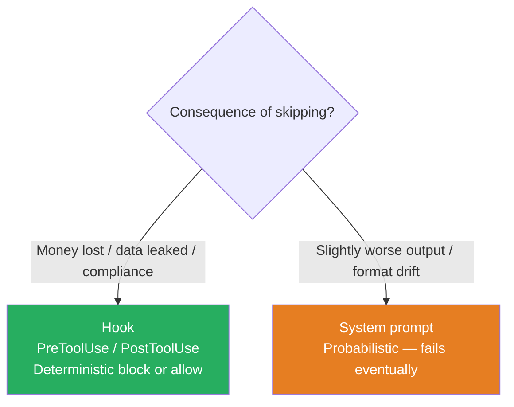

# Hooks vs Prompts

Use hooks for **deterministic enforcement** (financial/safety/compliance); use prompts for **soft preferences** (tone, format). Prompts are probabilistic — they will fail eventually.

### Key Concepts



- **Prompts are probabilistic** (~70% reliable on novel cases) — never guard money, deletion, or compliance with prompt instructions alone. If production data shows the agent skips a required step, the fix is a programmatic prerequisite, not a better prompt
- Hooks fire even when the model didn't intend the action — write hook messages that *educate* the model so it self-corrects
- A hook that always blocks (no recovery path) creates infinite loops; return a `reason` the model can act on
- Loop control (`stop_reason`) controls termination, not tool sequencing — don't use it for business rule enforcement
- **Decision priority** within a hook return: `deny` > `defer` > `ask` > `allow`
- **Deterministic computation belongs in tool code, not the prompt.** Date windows (30-day return policy), dollar caps, percentage limits, day-counts — the model is probabilistic at arithmetic; let the tool compute and return a boolean (`check_return_eligibility(order_id)` → `{eligible, reason}`)
- **Destructive operations are rejected in the tool implementation, not in the prompt.** A SQL-execution tool parses incoming statements and refuses `DROP`, `TRUNCATE`, unrestricted `DELETE`/`UPDATE` before the database sees them — this survives every prompt-injection variant
- **Multi-step interdependency via signed tokens.** When step A must happen before step B (preview → execute, sanctions check → wire transfer, KYC → payout), tool A returns a short-lived, single-use, signed token; tool B verifies the signature before executing. The model can't satisfy B without first calling A — the constraint is in code, not in the prompt

##### Available hook events

| Event | Py / TS | Triggered by |
|---|---|---|
| `PreToolUse` | both | Tool call request (can block/modify) |
| `PostToolUse` | both | Tool execution result |
| `PostToolUseFailure` | both | Tool execution failure |
| `PostToolBatch` | TS only | Whole batch resolves before next model call |
| `UserPromptSubmit` | both | User prompt sent |
| `Stop` | both | Agent finishes |
| `SubagentStart` / `SubagentStop` | both | Subagent lifecycle |
| `PreCompact` | both | Before context compaction |
| `PermissionRequest` | both | Permission dialog about to display |
| `Notification` | both | Status messages (`permission_prompt`, `idle_prompt`, `auth_success`, …) |
| `SessionStart` / `SessionEnd` | TS only | Session lifecycle (Py: use `settings.json` shell hooks) |

**Matchers** filter by **tool name only**, not file paths or args. Filter by path inside the callback. Examples: `"Write|Edit|Delete"`, `"^mcp__"` (all MCP tools), or omit `matcher` for every event.

**Async (fire-and-forget)** hooks for pure side effects (logging, webhooks): return `{ async: true, asyncTimeout: 30000 }` — cannot block, modify, or inject context.

### How to

- Identify the consequence of the rule being skipped: financial → hook; compliance → hook; safety → hook; tone/format → prompt
- For mandatory tool ordering (e.g., `verify_identity` before `process_payment`), enforce in a `PreToolUse` hook
- For thresholds (refund cap, transaction size), block in a hook based on tool inputs
- Pair every blocking hook with an explanatory `reason` so the agent can self-correct or escalate
- Use `PostToolUse` hooks to **normalize tool output formats** (Unix timestamps → ISO 8601, numeric status codes → labels) so the model sees consistent shapes across providers

```typescript
// PostToolUse: normalize formats before the model sees them
hooks.postToolUse("get_orders", async ({ result }) => ({
  ...result,
  created_at: new Date(result.created_ts * 1000).toISOString(), // unix → ISO 8601
  status:     STATUS_CODES[result.status_code],                 // numeric → label
}));

// PreToolUse: deterministic compliance — block instead of asking the model nicely
hooks.preToolUse("issue_refund", async ({ input }) => {
  if (input.amount > 500) {
    return {
      block: true,
      replacement_tool: "escalate_to_human",
      reason: "Exceeds auto-refund cap of $500",
    };
  }
});
```

```jsonc
// settings.json — hook enforces mandatory ordering deterministically
{
  "hooks": {
    "PreToolUse": [{
      "matcher": "process_payment",
      "hooks": [{ "type": "command",
                  "command": "scripts/require-prior-tool.sh verify_identity" }]
    }]
  }
}
```

```python
# Hook for refund cap — programmatic threshold
def pre_tool_use(tool_name, tool_input):
    if tool_name == "process_refund" and tool_input["amount"] > 1000:
        return {"decision": "block",
                "reason": "Escalate refunds > €1000 to a human operator."}
```

```markdown
<!-- system prompt — soft preferences -->
Use a formal tone. Always summarize findings before asking the user to confirm.
```

### Anti-patterns

- Enhanced system prompt for guaranteed tool ordering — probabilistic; insufficient for financial or safety consequences ❌
- Few-shot examples for ordering enforcement — same limitation as system prompt ❌
- Relying on `stop_reason` checks for business rule enforcement — this controls loop termination, not tool sequencing ❌
- Hook with no recovery path (always blocks) — creates infinite loops ❌

### Problem: Unordered tool calls cause account misidentification

Agent skips `get_customer` and calls `lookup_order` with only the customer's name — 12% of cases misidentify accounts with financial consequences. Prompt instructions fail probabilistically; enhancing the prompt or adding few-shot examples has the same limitation. **Solution:** programmatic prerequisite gate — block `lookup_order` and `process_refund` until `get_customer` returns a verified customer ID.

### Use case: Hook vs Prompt Decision

For each rule, decide: hook or prompt instruction?

1. Agent must always call `verify_identity` before `process_payment` — financial consequence if skipped
2. Agent should prefer formal tone in responses
3. Agent must never issue a refund above €1000 without human escalation
4. Agent should summarize its findings before asking for confirmation

**Answers:** 1 → hook, 2 → prompt, 3 → hook, 4 → prompt.
