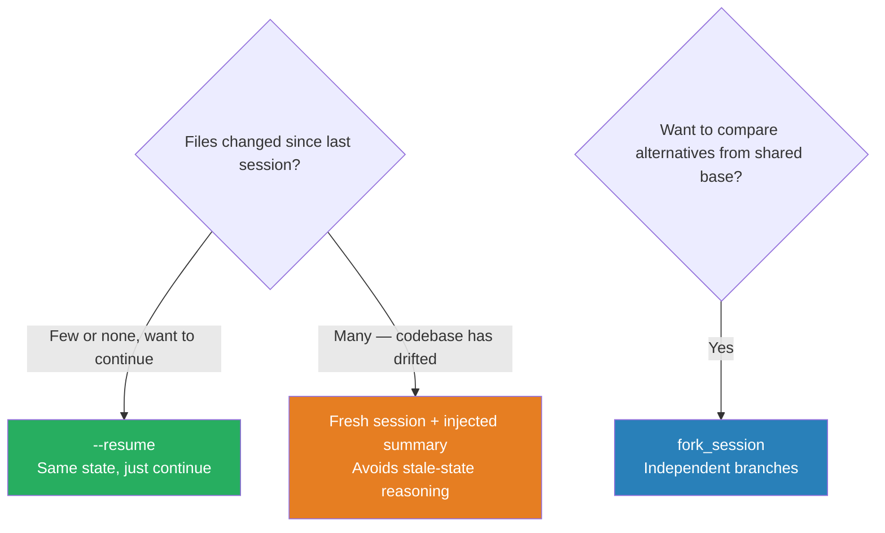

# Session Resumption

Pick `--resume` when state is fresh, `fork_session` when comparing alternatives from a shared base, and **start fresh with a summary** when too much has changed since the prior session.

### Key Concepts



| Mechanism | Use when |
|---|---|
| `--resume` | Same state, just continue from where you left off |
| `fork_session` | Compare two approaches starting from a shared base |
| Fresh + summary | Codebase has drifted significantly (40+ files changed) — full re-exploration is needed |

- `--resume` on a stale codebase reasons from a past world — silent wrong answers
- Fork creates two sessions that *each* keep growing — costs add up; close losers promptly
- A fresh session with a too-short summary loses context that justified the original conclusion
- **Session storage**: persisted as JSONL at `~/.claude/projects/<encoded-cwd>/<session-id>.jsonl` — `<encoded-cwd>` replaces non-alphanumeric chars with `-`
- **Resuming requires the same `cwd`** — the most common cause of "I got a fresh session" bugs. Sessions are local to the machine; to move across hosts, ship the JSONL file (preserving `cwd`) or capture key results into application state
- **SDK session APIs**: `listSessions()`, `getSessionMessages()`, `getSessionInfo()`, `renameSession()`, `tagSession()` (and Python equivalents)
- **Pick-an-approach matrix**:

| Use case | API |
|---|---|
| One-shot | Plain `query()` call |
| Multi-turn in same process | `ClaudeSDKClient` (Py) / `continue: true` (TS) |
| Pick up after restart | `continue_conversation=True` / `continue: true` |
| Specific session | Capture ID, pass `resume` |
| Try alternatives | `forkSession: true` + `resume` |
| Stateless (TS only) | `persistSession: false` |

### How to

- Before resuming, check `git log` since the prior session — significant drift warrants a fresh start
- For genuine A/B comparisons (two refactor approaches, two architectures), fork from a shared base session
- When starting fresh, inject a tight summary of prior findings rather than raw transcripts
- **Tell the agent what changed** when resuming after refactors — file renames or moves silently invalidate cached references

```bash
# Continue a named investigation
claude --resume audit-2026-Q1 "Now check the payment flow"

# Fork to compare two approaches against the same starting context
claude --fork-session main "Try optimistic locking"
claude --fork-session main "Try a queue-based approach"

# Tell the agent what changed since last session — files may have moved
claude --resume audit-2026-Q1 "Note: src/auth/ was renamed to src/identity/"

# Stale results? Don't resume — start fresh with a structured summary
claude "Prior session concluded:
  - root cause: race in CheckoutService.commit
  - fix attempted: mutex around line 142
  - status: tests still failing intermittently
Continue from here."
```

```python
# 1 — same state, just continue
session = client.sessions.resume(session_id="sess_yesterday")

# 2, 4 — branch to compare alternatives from a shared base
base       = client.sessions.get("sess_arch_review")
session_a  = client.sessions.fork(base.id, label="extract_services")
session_b  = client.sessions.fork(base.id, label="modularize_in_place")

# 3 — too much drift; start fresh with a tight summary
client.messages.create(model=M, messages=[
    {"role": "user", "content": SUMMARY_OF_PRIOR_FINDINGS + "\n\n" + new_question},
])
```

### Anti-patterns

- Resuming a session with stale tool results — agent treats old data as current fact ❌
- Using `--resume` after heavy drift — start fresh with a summary instead ❌
- Forking when a simple resumption suffices — fork is for genuinely divergent approaches, not "I want to keep the old version around just in case" ❌

### Use case: which mechanism?

For each situation, choose: `--resume`, `fork_session`, or fresh start with injected summary.

1. You analyzed a codebase yesterday — no files have changed. Today you want to continue.
2. You want to compare two refactoring approaches (extract services vs modularize in place) starting from the same codebase understanding.
3. You analyzed a codebase two weeks ago — 40 files have been modified since.
4. You want to explore whether Redis caching or a CDN layer better solves a latency problem, starting from a shared architecture review.

**Answers:** 1 → `--resume` · 2 → `fork_session` · 3 → fresh + summary · 4 → `fork_session`.
