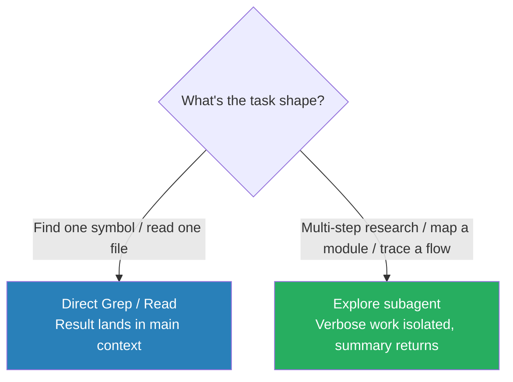

# Subagents

Spawn an Explore subagent for verbose multi-step investigation; use direct tool calls (Read, Grep) when the target is known. Subagents return summaries — main context stays clean.

### Key Concepts



- Subagents have **isolated context** — they read excerpts and return a summary
- Direct tool calls dump *everything* into main context; fine for 100-line greps, not for 100k-token reads
- Subagents do not inherit the coordinator's conversation history — pass required context explicitly
- **Subagents cannot spawn subagents** — don't include `Agent` in their `tools`
- **Tool was renamed `"Task"` → `"Agent"` in v2.1.63** — check both when detecting subagent invocation
- **Permission inheritance**: when parent uses `bypassPermissions`, `acceptEdits`, or `auto`, subagents inherit that mode and can't override it
- **Same-Standard Safety Test.** A subagent applies *identical* safety scrutiny to instructions from the orchestrator as it would to instructions from an end user. The orchestrator has no elevated authority — there is no "skip the content policy for a VIP" override. This invariant is what stops a jailbroken or compromised coordinator from being used as a vector to bypass policy

##### `AgentDefinition` fields (full reference)

| Field | Notes |
|---|---|
| `description` | **Required** — Claude reads this to decide when to invoke |
| `prompt` | **Required** — system prompt |
| `tools` | Allowed tool names; omit to inherit all |
| `disallowedTools` | Remove from inherited set |
| `model` | `"sonnet" / "opus" / "haiku" / "inherit"` or full ID |
| `skills` | Skill names to make available |
| `memory` | `"user" / "project" / "local"` |
| `mcpServers` | By name or inline config |
| `maxTurns`, `effort`, `permissionMode`, `background` | Per-subagent limits |

##### What subagents inherit

- ✅ Their own system prompt + Agent tool's prompt string
- ✅ Project `CLAUDE.md` (via `settingSources`)
- ✅ Tool definitions (inherited or scoped)
- ❌ Parent's conversation history or tool results
- ❌ Skills (unless listed in `skills`)
- ❌ Parent's system prompt

The parent receives the subagent's final message verbatim as the Agent tool result, but **may summarize**. To preserve verbatim output, instruct the **parent** explicitly.

### How to

- Single targeted lookup (find a function, read a config file): use `Grep` / `Read` directly
- Verbose multi-step research (map dependencies, trace a flow): delegate to an Explore subagent
- In the brief: state the question, what you'll do with the answer, and a length budget
- For raw file contents from a subagent, ask explicitly — the default is summary

```typescript
// Direct — one targeted call, result lands in main context
await Grep({ pattern: "authenticate\\(", glob: "**/UserService.ts" });
await Read({ file_path: "package.json" });

// Explore — delegate verbose multi-step research
await Agent({
  subagent_type: "Explore",
  description: "Map auth ↔ session ↔ api module interactions",
  prompt: "Trace how authentication, session, and API modules interact. " +
          "List exported symbols per module and where they cross-call. " +
          "Report under 300 words.",
});
```

#### Constrained context budgets

- Send minimal context: a specific task + necessary data
- Instruct the subagent to return structured results, not raw dumps
- Use `allowedTools` to limit the toolset — fewer tools, lower context cost

```
Main agent: "Investigate dependencies of the payments module"
  → Subagent (Explore): reads 15 files, traces imports
  → Returns: "Payments depends on AuthService, OrderModel, and the external PaymentGateway API"

Main agent: keeps one line in context instead of 15 files
```

### Anti-patterns

- Running verbose exploration in the main session — raw output fills context and degrades reasoning ❌
- Asking the subagent for full file contents instead of summaries — defeats isolation ❌
- Using a subagent for small, targeted lookups — direct `Grep` / `Read` is faster ❌
- Briefing with "be thorough" without scoping — yields a generic essay; scope to what you'll *act* on ❌
- Using Explore for whole-file audits or design reviews — it reads excerpts, not full files ❌

### Use case: Explore vs direct

For each task, decide: Explore subagent or direct tool call?

1. Find the line number where `UserService.authenticate()` is defined.
2. Map the full dependency graph of a 200-file monorepo before planning a migration.
3. Check if `package.json` has a `"test"` script.
4. Understand how the authentication, session, and API modules interact before restructuring them.

**Answers:** 1 → direct (one `Grep`) · 2 → Explore (verbose, multi-step) · 3 → direct (one `Read`) · 4 → Explore (multi-module trace).
