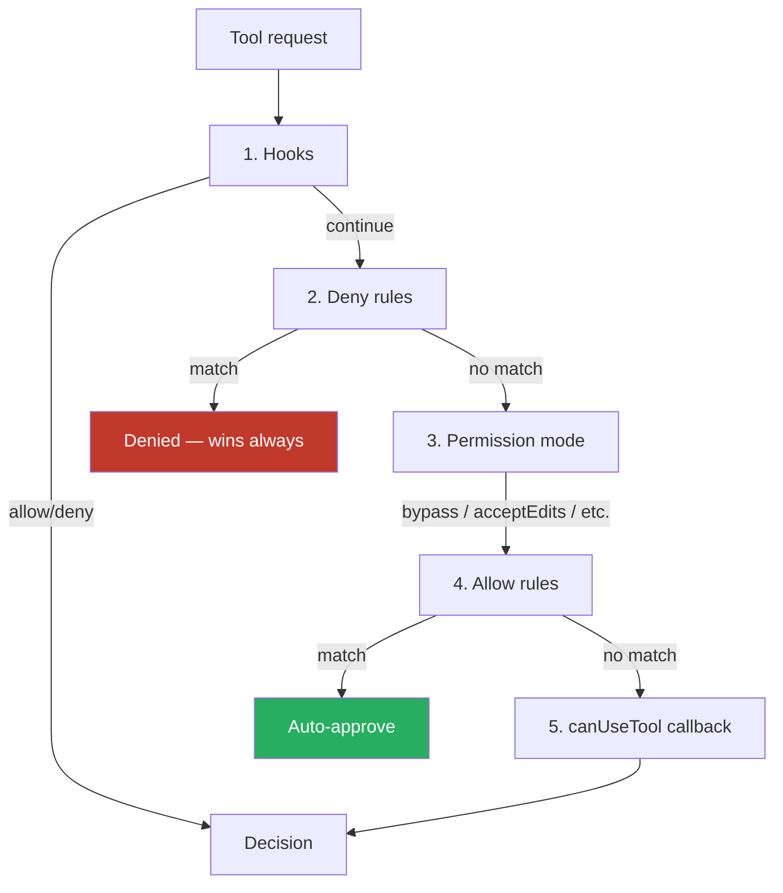

# Permission Modes

Six modes control what Claude can do without asking — pick looser modes for trusted exploration, stricter for sensitive code or autonomous runs. Layer **deny → ask → allow** rules on top.

### Key Concepts



| Mode | Auto-approves | Best for |
|---|---|---|
| **`default`** | Reads only | Sensitive work, getting started |
| **`acceptEdits`** | Reads + file edits + filesystem cmds (`mkdir`, `mv`, `cp`, `rm`, `sed`, `touch`) | Iterating on code you'll review later |
| **`plan`** | Reads only — produces a plan, no edits | Exploration before changes |
| **`auto`** | Everything, with a classifier model blocking risky actions | Long autonomous runs (Max/Team/Enterprise/API only; TS SDK only) |
| **`dontAsk`** | Only pre-approved tools; everything else **denied** | Locked-down CI |
| **`bypassPermissions`** | Everything (no checks) | **Isolated containers / VMs only** |

- A `deny` rule wins over `ask` and `allow` — even in `bypassPermissions`.
- **Switch with `Shift+Tab`** (cycle), `--permission-mode <mode>` at startup, or `permissions.defaultMode` in `settings.json`.
- **`auto` mode** is API/Max/Team/Enterprise only and TypeScript-SDK only — Python doesn't support it.
- **`bypassPermissions` ignores `allowedTools`** — use `disallowedTools` to block specific tools in bypass mode.
- **Subagent inheritance:** when parent uses `bypassPermissions` / `acceptEdits` / `auto`, subagents inherit that mode and **cannot override it**.

### How to

```json
{
  "permissions": {
    "defaultMode": "acceptEdits",
    "allow": ["Bash(npm test *)", "Bash(git status)", "Edit(src/**)"],
    "ask":   ["Bash(git push *)"],
    "deny":  ["Read(./.env)", "Read(./secrets/**)", "WebFetch", "Bash(rm -rf:*)"]
  }
}
```

**Pattern syntax:**

- `Bash(npm test *)` — any `bash` command starting with `npm test`
- `Read(./secrets/**)` — any read of any file under `./secrets/`
- `WebFetch` (no parens) — the entire tool, regardless of arguments

**Rule placement:**

- `./.claude/settings.json` — team-shared rules (committed)
- `./.claude/settings.local.json` — your personal rules for this project
- `~/.claude/settings.json` — your rules for every project
- Managed `settings.json` — org-wide; **`deny` rules here cannot be overridden**

**Protected paths** (never auto-approved except in `bypassPermissions`):

- `.git`, `.vscode`, `.idea`, `.husky`
- `.gitconfig` and shell rc files
- `.mcp.json`, `.claude.json`
- `.claude/` (with exceptions: `commands/`, `agents/`, `skills/`, `worktrees/` *can* be auto-approved)

### Programmatic control (Agent SDK)

```typescript
options: {
  allowedTools: ["Read", "Grep"],          // auto-approve these
  disallowedTools: ["Bash"],               // always deny (even in bypass)
  permissionMode: "default",
  canUseTool: async (toolName, input) => {
    if (await askUser(`Allow ${toolName}?`)) {
      return { behavior: "allow", updatedInput: input };
    }
    return { behavior: "deny", message: "User declined" };
  }
}

// Change mode mid-session
const q = query({ prompt: "...", options: { permissionMode: "default" } });
await q.setPermissionMode("acceptEdits");
```

**Lock-down pattern** (CI):

```typescript
options: {
  allowedTools: ["Read", "Glob", "Grep"],
  permissionMode: "dontAsk"   // anything else → denied, no prompt
}
```

### Choosing a mode

| Situation | Mode | Why |
|---|---|---|
| Reviewing what Claude wants to do | `default` | Reads auto-approve, everything else asks |
| Tight loop of edits + tests on familiar code | `acceptEdits` | Avoids approval-prompt fatigue |
| Architectural work, not ready to commit | `plan` | Exploration without edits |
| Long autonomous job, you're away | `auto` | Classifier guards risky actions |
| CI / GitHub Actions | `dontAsk` + explicit `allow` rules | Predictable, no human prompts |
| Throwaway VM or sandbox container | `bypassPermissions` | Speed; nothing to lose |

**Recommended workflow:**

- **Start in `default`; ratchet up to `acceptEdits`** once you've seen what tools Claude reaches for in your repo
- **Allowlist what you'd auto-approve anyway.** `npm test`, `git status`, `Read(./src/**)` — friction-free workflow, deny rules catch the rest
- **Deny secrets at the project (or managed) level.** `.env`, `secrets/**`, lockfiles — managed `settings.json` makes them un-overridable
- **For autonomy, layer two protections.** `auto` mode + a verification step (tests, lint); `bypassPermissions` only inside an isolated VM/container
- **Scope `Bash(...)` patterns to subcommands.** `Bash(git diff:*)` not `Bash(*)` — the latter is arbitrary command execution

### Anti-patterns

- Using `acceptEdits` to approve MCP tools — it only auto-approves file edits ❌
- Using `bypassPermissions` outside isolated containers — no recovery if anything goes wrong ❌
- Putting `deny` rules in user-level settings when they need to be org-wide — only managed `deny` cannot be overridden ❌
- Assuming subagents can downgrade their inherited permission mode — they cannot ❌
- Wildcard `Bash(*)` allow-list in CI — arbitrary command execution on your runner ❌
