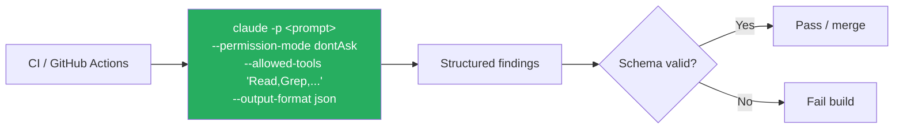

# CI / Headless Usage

Run Claude Code non-interactively in CI with `claude -p` (print), `--permission-mode dontAsk`, scoped `--allowed-tools`, and structured output via `--output-format json --json-schema`.

### Key Concepts



- `-p` (or `--print`) is required — without it Claude waits on a TTY and the job hangs until timeout
- Without `--permission-mode dontAsk`, the first tool call prompts and the run never completes
- Scope `--allowed-tools` to read-only or specific subcommands; a wildcard `Bash(*)` allow-list is arbitrary command execution on the runner
- Use `--output-format json` with `--json-schema` for structured findings that downstream gates can validate
- **Scale horizontally, not vertically.** A single long session accumulates incoherence; many short focused sessions stay sharp
- **Writer/Reviewer pattern**: one session writes the change, a *different* session reviews with fresh context — the writing session retains reasoning bias and won't catch its own mistakes
- **Daily-driver flags**: `-c` / `--continue` (resume latest), `-r` / `--resume [name]` (pick), `--from-pr <n>`, `-w <name>` / `--worktree`, `--permission-mode <mode>`, `--output-format json|stream-json`
- **Install commands**:
  - macOS / Linux / WSL: `curl -fsSL https://claude.ai/install.sh | bash`
  - Homebrew: `brew install --cask claude-code`
  - Windows: `winget install Anthropic.ClaudeCode`

### How to

- Set `ANTHROPIC_API_KEY` from a secret in the CI environment
- Pass the prompt via `-p` and the schema via `--json-schema ./schemas/findings.json`
- List exact tools needed in `--allowed-tools`; for `Bash`, scope to subcommands like `Bash(git diff:*)`
- Capture stdout to a file for downstream gates or PR comments
- On re-runs (new commits to the same PR), include the **prior review JSON** in context and instruct the model to report only NEW or unaddressed issues
- Use `--include "tests/**/*.test.ts"` to hand the model existing test fixtures so it doesn't reinvent the test style
- For independent reviews, **start a fresh session** for the review pass — the generator's session defends its own choices
- Run `claude -p` in CI / pre-commit hooks
- Use **worktrees** (`git worktree add`) for parallel sessions on different features

```yaml
# Re-run on new commits, suppress already-reported issues
- name: Claude review (incremental)
  run: |
    claude -p "Review again. Prior findings: $(cat last-review.json).
              Report only NEW or unfixed issues." \
      --output-format json
```

```bash
# Use a fresh instance for review — independent eyes
claude -p "Generate the implementation"      > impl.ts
claude -p "Review impl.ts for correctness"   > review.json   # new session

# Hand the model existing test fixtures so style stays consistent
claude -p --include "tests/**/*.test.ts" "Add tests for the new endpoint"
```

```yaml
# .github/workflows/security-review.yml
- name: Claude security review
  run: |
    claude -p "Analyze this PR for security issues" \
      --output-format json \
      --json-schema ./schemas/security-findings.json \
      --permission-mode dontAsk \
      --allowed-tools "Read,Grep,Bash(git diff:*)" \
      > findings.json
  env:
    ANTHROPIC_API_KEY: ${{ secrets.ANTHROPIC_API_KEY }}
```

#### Suggested invocations by scenario

| Scenario | Command |
|---|---|
| Local interactive dev | `claude` |
| Architectural change (multi-file) | `claude --plan` |
| Autonomous run on isolated branch | `claude --permission-mode auto --cwd ../wt-feature --post-task "npm test && npm run lint"` |
| CI / GitHub Actions | `claude -p "<prompt>" --permission-mode dontAsk --allowed-tools "Read,Grep,Bash(git diff:*)"` |
| Compliance-sensitive | Managed `settings.json` deny rules + protected paths |

### Anti-patterns

- Forgetting `-p` (or `--print`) leaves Claude in interactive mode — the job hangs until timeout
- Running CI without `--permission-mode dontAsk` — the first tool call prompts and the run never completes
- Wildcard `Bash(*)` allow-list in CI — arbitrary command execution on your runner; scope to read-only subcommands
- `auto` mode without a verification step (tests, lint) — can silently produce broken code on long runs
- `acceptEdits` without protected paths — accepts *all* edits in scope; no durable guard against unintended writes

### Use case: write a CI command

Write the correct shell command for a GitHub Actions pipeline that:

1. Analyzes a pull request for security issues.
2. Outputs structured JSON findings against a provided schema.
3. Does not hang waiting for user input.

**Sample answer:** `claude -p "Analyze this PR for security issues" --output-format json --json-schema ./schemas/security-findings.json --permission-mode dontAsk --allowed-tools "Read,Grep,Bash(git diff:*)"`
