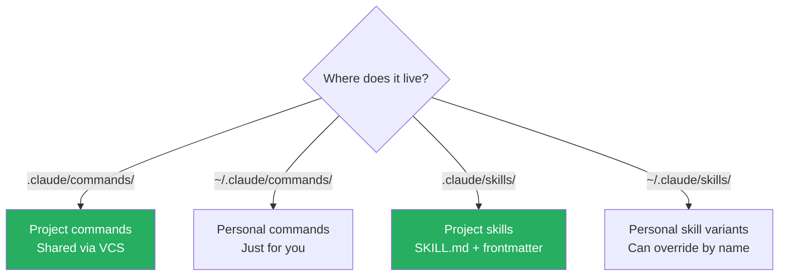

# Slash Commands and Skills

Project files in `.claude/` are shared via VCS; personal files in `~/.claude/` are not. A personal skill in `~/.claude/skills/<name>/` with the same name as a project skill **overrides** the project version for that user.

### Key Concepts



**SKILL.md frontmatter:**

| Field | Effect |
|---|---|
| `name` | The slash trigger (`/run-migration`) |
| `description` | One-line summary, always loaded into context |
| `context: fork` | Run the skill in an isolated subagent — verbose output stays out of main session |
| `allowed-tools` | Restrict the skill's toolset (e.g., `[Bash, Read]`) |
| `argument-hint` | Prompt the developer for a required parameter |

- Skills' **descriptions are always loaded** into context — keep them under one sentence
- **Skills can be invoked autonomously by Claude** based on the SKILL.md `description`; `.claude/commands/` is the legacy format that supports `/name` invocation only, while `.claude/skills/<name>/SKILL.md` supports both
- **`allowed-tools` frontmatter only works in CLI**, not via the SDK — control SDK tool access through the main `allowedTools` option
- **Custom command syntax** in `.claude/commands/` markdown body:
  - `$1`, `$2`, `$ARGUMENTS` — positional args
  - `` ! `cmd` `` — execute bash, embed output
  - `@filepath` — embed file contents
  - Subdirectories namespace commands (e.g., `frontend/component.md` → `/component (project:frontend)`)
- **Plugin skills** are namespaced as `plugin-name:skill-name`; CLI-installed plugins live under `~/.claude/plugins/`

### How to

```markdown
<!-- .claude/skills/run-migration/SKILL.md -->
---
name: run-migration
description: Apply pending DB migrations safely
context: fork                    # isolated subagent — verbose output stays out of main session
allowed-tools: [Bash, Read]      # tool restriction
argument-hint: "<env: dev|staging|prod>"
---

1. Show pending migrations with `npm run migrate:status`
2. Apply with `npm run migrate -- --env=$1`
3. Verify with `npm run migrate:status`
```

- For team-shared workflows (deploy, migrate, release-cut), use **project skills** in `.claude/skills/`
- For ad-hoc personal shortcuts (a custom `/scratch` notebook), use `~/.claude/commands/`
- Use `context: fork` whenever the skill calls Bash heavily or reads many files
- Scope `allowed-tools` to the minimum — a `/format` skill needs only `Edit`, not network access

### Anti-patterns

- Creating team commands in `~/.claude/commands/` — invisible to teammates, requires manual duplication
- Embedding command definitions in `CLAUDE.md` body — creates text instructions, not an invocable command
- Skills that write extensively to main session context without `context: fork`
- Bloated `description` fields — they're always loaded
- Using a `.claude/config.json` `commands` array — this mechanism does not exist
