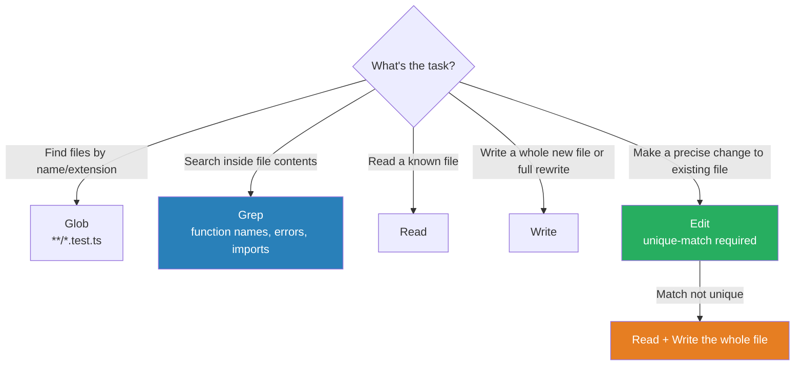

# Built-in Tools

Claude Code ships with a file/search/execution toolset; the Claude API exposes a parallel set of server-side tools you register per request. Pick the cheapest tool that produces deterministic, citation-bearing output.

### Key Concepts

#### Claude Code tools



| Tool | Use for | Example |
|---|---|---|
| **Glob** | File discovery by pattern | `**/*.test.ts`, `src/services/**/*.ts` |
| **Grep** | Content search inside files | `createCustomer\(`, `TODO\|FIXME` |
| **Read** | Full-file inspection | reading a config, tracing a flow |
| **Write** | New file or full rewrite | scaffolding a module |
| **Edit** | Precise change to existing file | replace a unique snippet |

| Category | Tools |
|---|---|
| File operations | `Read`, `Edit`, `Write`, `NotebookEdit` |
| Search | `Grep`, `Glob`, `LS` |
| Execution | `Bash` (and `PowerShell` on Windows) |
| Web | `WebFetch`, `WebSearch` |
| Orchestration | `Agent` (subagents), `AskUserQuestion`, `TodoWrite` |
| Code intelligence | Type errors, jump-to-def, find references (via [code intelligence plugins](https://code.claude.com/docs/en/discover-plugins#code-intelligence)) |

- Build understanding incrementally: Grep entry points first, then Read the matched files, then Grep the called functions
- `Edit` requires `old_string` to appear **exactly once** — otherwise use Read + Write
- Prefer dedicated tools over Bash equivalents (`grep`, `find`, `cat`) — scoped, observable, faster

#### Claude API server-side tools

| If you need... | Reach for | Why |
|---|---|---|
| Fresh facts from the web | **web_search** | Server-side, citations included |
| One specific URL ingested | **web_fetch** | Cheaper than search, deterministic target |
| Math, data crunching, plots | **code_execution** | Free with web tools, no hallucinated arithmetic |
| Cheaper long agent loops | **advisor** | Two-tier model routing |
| Run shell commands | **bash** | Battle-tested schema |
| Edit files in the user's repo | **text_editor** | Same schema Claude Code uses |
| Remember across sessions | **memory** | Avoids re-stuffing context |
| Drive a GUI without APIs | **computer_use** | Last resort, but powerful |

- `code_execution` runs in a sandbox: no network by default, no persistent state across turns unless you opt in
- `code_execution` is **free** when paired with `web_search` or `web_fetch` in the same request — natural for "fetch this dataset and analyze it"
- Citations from web tools are sentence-level — pair with your synthesis layer to preserve provenance
- **advisor** pairs a fast executor model with a smarter advisor that intervenes on hard sub-problems — worth the wiring only when the workload has a long tail of hard sub-decisions
- **ZDR support**: web_search ✅ (except dynamic filtering), web_fetch ✅, code_execution ❌, advisor ✅, bash ✅, text_editor ✅, memory ✅ (your storage choice determines residency), computer_use ✅
- **Programmatic tool calling** runs multi-tool workflows from inside a code-execution sandbox instead of one API turn per step — cuts latency and tokens; ZDR ❌; errors harder to introspect than per-turn calls

### How to

```bash
# Claude Code — discovery: find files by pattern
Glob "**/*.test.ts"
Glob "src/services/**/*.ts"

# Claude Code — content: search inside files
Grep "createCustomer\("                  # exact call sites
Grep "TODO|FIXME" --type ts              # task markers
Grep "import .* from '@/auth'"           # who depends on this module

# Claude Code — tracing a flow incrementally
Grep "router\.post"                       # entry points
  → Read src/routes/orders.ts             # follow into the handler
  → Grep "validateOrder"                  # trace one called function
  → Grep "validateOrder" --type ts -A 5   # see definitions with context

# Edit fails on non-unique match → fall back to Read + Write
Edit foo.ts "value" "newValue"            # error: 3 matches
Read foo.ts; Write foo.ts <full updated content>
```

```python
# Claude API — register server-side tools
tools = [
    {"type": "web_search_20250903",     "name": "web_search"},
    {"type": "web_fetch_20251018",      "name": "web_fetch"},
    {"type": "code_execution_20250825", "name": "code_execution"},
    {"type": "bash_20250124",           "name": "bash"},
    {"type": "text_editor_20250728",    "name": "str_replace_based_edit_tool"},
    {"type": "memory_20250818",         "name": "memory"},
]
```

- Known URL (doc page, API spec) → `web_fetch`
- Research where the right URL isn't known → `web_search`
- Long agent loops → route trivial steps through `advisor`, reserve the main model for hard ones

### Anti-patterns

- Using Bash `grep` or `find` when the `Grep` / `Glob` Claude Code tools are available — slower, less observable ❌
- Attempting `Edit` when anchor text appears multiple times in the file — use `Read` + `Write` instead ❌
- Reading 30 files upfront to "understand the codebase" — Grep entry points first, then Read selectively ❌
- Using `Read` on a 100k-token file when a `Grep` excerpt would answer the question ❌
- Using `web_search` when you already have the URL — pays for indexing you don't need ❌
- Asking the model to do arithmetic in prose — `code_execution` exists for a reason ❌
- Reaching for `computer_use` before checking whether an API or CLI exists ❌
- Mixing `bash` with broad allow-lists in production — scope to safe subcommands ❌
