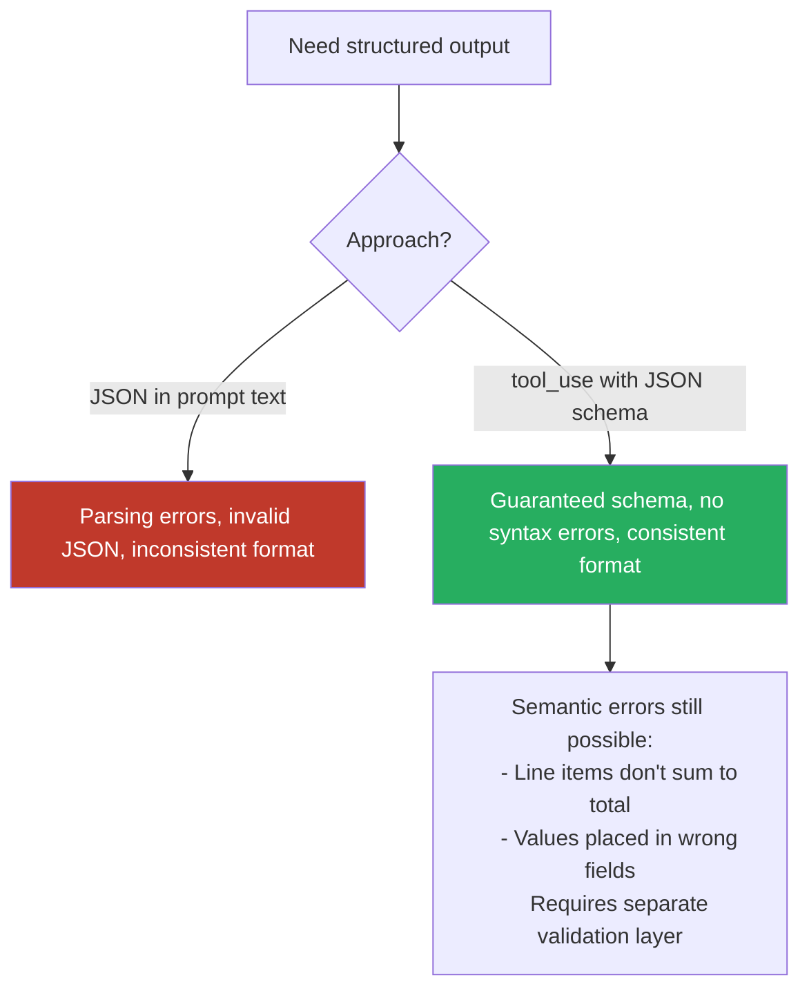

# Structured Output via Tool Use

`tool_use` with JSON schemas guarantees schema-compliant output — it eliminates syntax errors but not semantic ones (wrong field placement, values that don't sum).

### Key Concepts



| `tool_choice` value | Guarantee | Use when |
|---|---|---|
| `"auto"` | Model may return text OR call a tool | Default; unreliable for guaranteed output |
| `"any"` | Model must call a tool, free choice of which | Multiple schemas; document type unknown at runtime |
| `{"type": "tool", "name": "..."}` | Model must call this specific tool | Force a specific step first (e.g., metadata before enrichment) |

- Nullable fields prevent hallucination: if a required field has no source data, the model fabricates a value — make it nullable instead.
- Nullable + required forces the model to *decide* "absent" rather than silently omit.
- `"other"` + detail string pattern for extensible enum categories.
- Add a semantic validation layer on top of schema validation for sum checks and cross-field consistency.

##### Agent SDK structured output

The SDK validates against a JSON Schema and **automatically re-prompts on mismatch**:

```typescript
import { z } from "zod";

const FeaturePlan = z.object({
  feature_name: z.string(),
  steps: z.array(z.object({
    step_number: z.number(),
    description: z.string(),
    estimated_complexity: z.enum(["low", "medium", "high"])
  }))
});

for await (const message of query({
  prompt: "Plan dark mode for a React app",
  options: {
    outputFormat: { type: "json_schema", schema: z.toJSONSchema(FeaturePlan) }
  }
})) {
  if (message.type === "result" && message.subtype === "success") {
    const plan = FeaturePlan.parse(message.structured_output);
  }
}
```

Python equivalent uses **Pydantic**: `model.model_json_schema()` to generate the schema, `model.model_validate(message.structured_output)` to parse the result.

**Validation failure:** `subtype === "error_max_structured_output_retries"`. Always check `subtype` before reading `structured_output`.

##### Tool annotations

| Field | Default | Meaning |
|---|---|---|
| `readOnlyHint` | `false` | No side effects → can run in parallel |
| `destructiveHint` | `true` | May destroy data (informational) |
| `idempotentHint` | `false` | Repeats are safe (informational) |
| `openWorldHint` | `true` | Reaches outside the process |

```json
{
  "amount":          { "type": ["number", "null"] },
  "category":        { "type": "string", "enum": ["hardware", "software", "services", "other"] },
  "category_detail": { "type": ["string", "null"], "description": "Specify when category is 'other'" }
}
```

#### Self-correction pattern

Extract both the stated value and a computed value so downstream code can flag the discrepancy instead of silently picking one:

```json
{
  "stated_total": "$150.00",
  "calculated_total": "$145.00",
  "conflict_detected": true,
  "line_items": [
    {"name": "Widget A", "price": 75.00},
    {"name": "Widget B", "price": 70.00}
  ]
}
```

#### Pydantic as a validation tool

Python library for schema-based data validation. Key uses:

- **Structural validation:** types, requiredness, enum constraints checked in code after receiving JSON from Claude.
- **Semantic validation:** custom validators enforce business logic (sum of items equals total; `start_date < end_date`).
- **Validate–retry loops:** on validation failure, construct an error message and re-prompt Claude with the error context.
- **JSON Schema generation:** Pydantic models emit JSON Schema for `tool_use`, giving a single source of truth.

### Anti-patterns

- Requesting JSON output in the prompt text — parsing errors and inconsistent structure ❌
- `tool_choice: "auto"` when structured output is required — model may respond with text ❌
- `"auto"` with a single tool often yields prose instead of a call — don't rely on it for guarantees ❌
- `tool_choice: "any"` forces a call but the model may pick the wrong tool — pair with great descriptions ❌
- `tool_choice: "any"` also **suppresses text-only replies**, so the model can't ask a clarifying question even when input is ambiguous — for conversational agents that need to clarify, stay on `"auto"` ❌
- `tool_choice: {"type": "tool"}` (forced) skips the model's judgment — useful for first-step pipelines, dangerous if input might not warrant the tool ❌
- Treating schema-valid output as semantically correct ❌
- Required fields for optional information — forces hallucination when data is absent ❌
- A bare `number` field invites hallucination when absent — wrap with `{present, value}` so "missing" is a first-class state ❌
- Enum + "other" without `other_detail` collapses every unrecognized type to "other" with no signal ❌

### Problem: Inconsistent code review output format

**Scope:** `cross-cutting`

**Problem:** Code review findings vary in format and false-positive rate — some flag minor style as high severity, JSON structure differs between invocations.

**Root cause:** No format enforcement; model interprets "review" differently each run.

**Key decision:** Few-shot calibration vs strict JSON schema only vs post-processing normalization vs multi-run consensus.

**Solution:** Combine few-shot examples covering genuine bugs, acceptable patterns (explicit null output), and ambiguous cases — with JSON schema enforcement via `tool_use`.

**Anti-pattern:** Multi-run consensus voting (suppresses intermittent real bugs); schema alone without calibration examples (format consistent, severity and false-positive rate uncalibrated).

### Use case: tool_choice Selection

For each scenario, choose the correct `tool_choice` value:

1. Three extraction schemas (invoice, receipt, purchase_order) — document type is unknown at runtime
2. `extract_document_metadata` must always run before any enrichment step
3. Let Claude decide whether to call a tool or respond conversationally
4. Guarantee the model calls a tool, but don't care which schema it picks

```python
# 1 — must call one of the extraction tools, model picks
client.messages.create(..., tool_choice={"type": "any"})

# 2 — force a specific tool
client.messages.create(..., tool_choice={"type": "tool",
                                          "name": "extract_document_metadata"})

# 3 — model decides whether to use a tool
client.messages.create(..., tool_choice={"type": "auto"})

# 4 — must call any tool
client.messages.create(..., tool_choice={"type": "any"})
```

Answers: 1→`"any"`, 2→`{"type":"tool","name":"extract_document_metadata"}`, 3→`"auto"`, 4→`"any"`

### Use case: Schema Design

Design a JSON schema for extracting contract terms from legal documents:

- Required fields: `contract_type`, `effective_date`
- Optional fields: `termination_clause`, `penalty_amount`
- `contract_type` uses an enum with an "other" + detail pattern
- `penalty_amount` prevents hallucination when absent

```json
{
  "type": "object",
  "required": ["contract_type", "effective_date"],
  "properties": {
    "contract_type": {
      "type": "object",
      "required": ["value"],
      "properties": {
        "value":        { "type": "string",
                          "enum": ["nda", "msa", "sow", "license", "employment", "other"] },
        "other_detail": { "type": "string",
                          "description": "Required iff value == 'other'." }
      }
    },
    "effective_date": { "type": "string", "format": "date" },
    "termination_clause": { "type": ["string", "null"] },
    "penalty_amount": {
      "type": "object",
      "required": ["present"],
      "properties": {
        "present":  { "type": "boolean" },
        "value":    { "type": ["number", "null"] },
        "currency": { "type": ["string", "null"] }
      },
      "description": "Set present=false if no penalty clause exists; do not invent."
    }
  }
}
```
