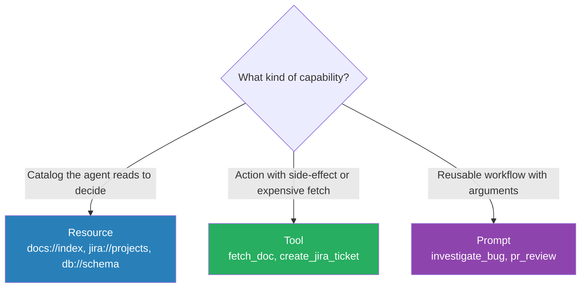

# MCP Servers Design

Classify each capability as a Resource (passive catalog), Tool (parameterized action), or Prompt (reusable workflow template) — getting this wrong forces unnecessary tool call chains or hides actions from agents.

### Key Concepts



- **Resources**: passive catalogs (`documentation_index`, `database_schema`, `available_fixtures`)
- **Tools**: active actions (fetch a document, create an issue, run a query)
- **Prompts**: reusable workflow templates with arguments (e.g., `pr_review`) — they expand into messages, they don't execute
- A tool that returns a static catalog wastes a turn — promote it to a resource
- A resource that triggers a query on every read is a tool in disguise — surface it as a tool with an input schema
- Agents won't browse deep resource trees reliably; flatten to one navigable index per concern
- **Tool annotations** (TS): `readOnlyHint: true` enables parallel execution; `destructiveHint`, `idempotentHint`, `openWorldHint` are informational
- **Tool name format** in SDK: `mcp__<server-name>__<tool-name>`; wildcard `mcp__github__*` allows all tools from a server
- **Availability** (`tools: []` removes a built-in from view) vs **permission** (`disallowedTools` denies but keeps it in context, so Claude may still try). Prefer `tools` to remove entirely.

### How to

- Content discovery (what exists) → **resource**; actions (what to do with it) → **tool**; reusable parameterized workflows → **prompt** (template, not executable)
- Return `isError: true` from tools instead of raising — keeps the agentic loop alive for recovery
- Annotate destructive tools with `destructiveHint` so the agent surfaces confirmation; mutating actions (create ticket, send email) need explicit confirmation paths

```python
# Resource — passive catalog, agent reads to decide
@server.resource("docs://index")
async def documentation_index() -> str:
    return json.dumps([
        {"id": "auth",    "title": "Authentication", "topics": ["jwt", "oauth"]},
        {"id": "billing", "title": "Billing",        "topics": ["plans", "invoices"]},
    ])

# Tool — active action with side-effect or expensive fetch
@server.tool("fetch_doc")
async def fetch_doc(doc_id: str) -> str:
    return await load_full_doc(doc_id)

# Prompt — reusable workflow template with arguments
@server.prompt("pr_review")
async def pr_review(pr_number: int): ...
```

### Anti-patterns

##### Tools

- Writing minimal tool descriptions — agent selects tools by description quality, not capability ❌
- Throwing errors instead of returning `isError: true` — kills the agentic loop rather than allowing recovery ❌
- Exposing destructive tools without explicit `destructiveHint` annotation ❌

##### Resources

- Using tools for content discovery that could be exposed as resources — forces unnecessary tool call chains ❌
- Conflating resources (what exists) with tools (what to do with it) ❌
- A resource expensive to compute on read should be a tool with caching ❌

##### Prompts

- Duplicating prompt logic across system prompts in multiple projects — centralize in the MCP server ❌
- Static prompts with no arguments where parameterization would reduce duplication ❌
- Hiding mutating actions behind prompt-only flows; surface them as tools with confirmation ❌

### Use case: Resources vs Tools vs Prompts

For a knowledge base + Jira integration, classify each as a Resource, Tool, or Prompt:

1. A listing of all available documentation sections and their topics
2. Fetching the full content of a specific documentation page
3. A hierarchical index of all Jira projects and their issue types
4. Creating a new Jira ticket
5. A database schema showing all tables and their columns
6. A reusable "investigate this bug" workflow that pulls related issues and recent deploys
7. A checklist-driven PR review template parameterized by PR number

```python
# 1, 3, 5 → Resources (passive catalogs)
@server.resource("docs://index")        async def docs_index(): ...
@server.resource("jira://projects")     async def jira_projects(): ...
@server.resource("db://schema")         async def db_schema(): ...

# 2, 4 → Tools (parameterized actions)
@server.tool("fetch_doc")               async def fetch_doc(doc_id: str): ...
@server.tool("create_jira_ticket")      async def create_jira_ticket(...): ...

# 6, 7 → Prompts (reusable workflow templates with arguments)
@server.prompt("investigate_bug")       async def investigate_bug(bug_id: str): ...
@server.prompt("pr_review")             async def pr_review(pr_number: int): ...
```
