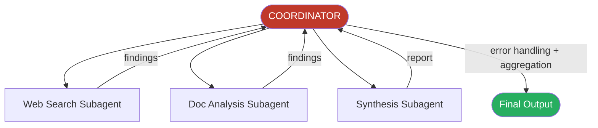

# Hub-and-Spoke Architecture

All inter-subagent communication routes through the coordinator. Subagents do not talk to each other and do not inherit parent context.

### Key Concepts



- Coordinator handles **all** inter-subagent communication, error routing, and result aggregation
- Subagents run with **isolated context** — they receive only what the coordinator passes in the prompt
- **Principle of Least Context** — subagents receive only the scoped task data they need, never the parent's full conversation history. If a downstream subagent has no references to an upstream subagent's findings, it's because the coordinator didn't route them forward, not because the subagents failed to coordinate
- Decomposition errors (too narrow a scope) belong to the coordinator, not to subagents that executed correctly

### How to

- Pass complete findings from prior agents directly in the subagent's prompt
- Use structured formats to separate content from metadata (source URLs, document names, page numbers)
- Write coordinator prompts with research goals and quality criteria, not step-by-step procedures
- Enumerate all relevant sub-domains before spawning — narrow decomposition is a coordinator error
- Iterate: evaluate synthesis output for gaps, re-delegate with targeted queries, re-synthesise until coverage is sufficient

```
# WRONG — subagent cannot resolve missing context
spawn synthesis_agent: "synthesise the research findings"

# CORRECT — all context passed explicitly
spawn synthesis_agent: """
WEB SEARCH RESULTS: [full structured output from web_search_agent]
DOCUMENT ANALYSIS: [full structured output from doc_analysis_agent]
Preserve source attribution (URL, document name, page) for each claim.
"""
```

### Anti-patterns

- Subagents communicating directly without routing through the coordinator
- Out-of-band side channels (Redis, a shared file, a message bus) used to exchange findings between subagents — same failure mode as a direct call: the coordinator loses the reasoning chain
- Relying on automatic context inheritance
- Procedural step-by-step coordinator prompts — they create rigidity and miss tangential sources
- Fixing the synthesis or search agent when the root cause is coordinator decomposition scope
- Parallel sub-topic spawning that loses *which* agent owns *which* region — pass region in the brief and require it in the output
- Evaluating coverage by token count instead of checking sub-topic *names* against the decomposition
- Re-delegation looping forever when the coverage check never passes — cap iterations and fail loud

### Problem: Narrow coordinator decomposition produces incomplete coverage

**Scope:** `agent-sdk`

**Problem statement:** Final reports on "impact of AI on creative industries" cover only visual arts — music, writing, and film are absent. All subagents completed successfully.

**Root cause:** Coordinator decomposed the task into only "AI in digital art," "AI in graphic design," "AI in photography."

**Key decision:** Fix search agent, synthesis agent, or coordinator scope?

**Solution:** Fix coordinator decomposition to enumerate all relevant sub-domains before spawning. Add an iterative refinement loop where the coordinator checks coverage after synthesis and re-delegates for gaps. The search and synthesis agents executed correctly — do not change them.

### Use case: Design and Debug a Multi-Agent Pipeline

Build a coordinator that:

1. Decomposes "renewable energy adoption barriers in EU vs APAC" into a complete set of sub-topics
2. Spawns web search and document analysis subagents with explicit context
3. Evaluates synthesis output for coverage gaps
4. Re-delegates with targeted queries if gaps exist
5. Preserves source attribution through all stages

```python
def coordinator(question):
    sub_topics = decompose(question)            # ["EU policy", "APAC policy",
                                                #  "EU grid infra", "APAC grid infra",
                                                #  "EU public sentiment", "APAC public sentiment"]

    findings = parallel([                       # spawn with explicit, scoped briefs
        spawn("web_search",  topic, region) for topic, region in sub_topics
    ] + [
        spawn("doc_analyze", topic, corpus) for topic in sub_topics
    ])

    draft = spawn("synthesis", findings, attribution_required=True)

    gaps = evaluate_coverage(draft, sub_topics)
    while gaps:
        more = parallel([spawn("web_search", g, region) for g, region in gaps])
        draft = spawn("synthesis", findings + more, attribution_required=True)
        gaps = evaluate_coverage(draft, sub_topics)

    return draft   # every claim has [source, region, date]
```
