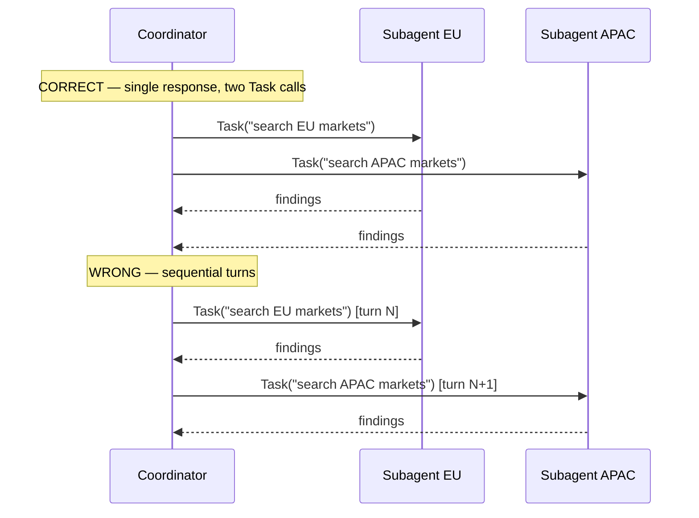

# Parallel Subagent Execution

Parallel = multiple `Task` calls in one coordinator response. Sequential = one `Task` call per turn.

### Key Concepts



- Coordinator's `allowedTools` **must include `"Task"`** to spawn subagents
- Subagents are defined via `AgentDefinition`: description, system prompt, tool restrictions
- Subagents **do not inherit parent context** — pass findings explicitly in the subagent's prompt
- Write coordinator prompts as **goals and quality criteria**, not step-by-step procedures — procedural prompts create rigidity and miss tangential sources
- When in doubt, write the dependency arrow; if there isn't one, run parallel

```typescript
// Coordinator must declare Task in allowedTools to spawn subagents
const coordinator: AgentDefinition = {
  description: "Research lead",
  allowedTools: ["Task", "Read"],
  systemPrompt: `Goal: report with citations.
Quality bar: every claim has a source URL and a verbatim quote.`,
};

// Subagents do NOT inherit parent context — pass it explicitly
const priorFindings = { ... };
await Promise.all([
  Task({
    subagent_type: "researcher",
    prompt: `### Prior findings\n${JSON.stringify(priorFindings)}\n\n### Task\nInvestigate X.`,
  }),
  Task({
    subagent_type: "researcher",
    prompt: `### Prior findings\n${JSON.stringify(priorFindings)}\n\n### Task\nInvestigate Y.`,
  }),
]);
```

### How to

- Include `"Task"` in coordinator's `allowedTools`
- Spawn independent subagents in a **single coordinator response** — do not wait for one to finish before spawning the next
- Pass required context explicitly in each subagent's prompt
- Use structured metadata to separate content from provenance in subagent outputs

```json
{
  "claim": "...",
  "evidence": "...",
  "source_url": "...",
  "document_name": "...",
  "publication_date": "2024-11-01"
}
```

### Anti-patterns

- One `Task` call per coordinator turn for "parallel" subagents — this is sequential ❌
- `"synthesise the research findings"` without including the actual findings in the prompt ❌
- Assuming subagents share memory or inherit coordinator context ❌
- Splitting independent work into sequential turns doubles wall-clock time ❌
- Forcing parallel on dependent work leaves the second agent without the first's findings — generic output ❌

### Use case: Parallel vs Sequential Turn Structure

**Scenario A:** Coordinator researches EU and APAC energy policy — independent.
**Scenario B:** Coordinator researches EU policy, then uses those findings to formulate a targeted APAC query.

```
Scenario A — independent → one response, two Task calls
┌─ coordinator response 1
│    Task(EU_research)      ──┐
│    Task(APAC_research)    ──┤  parallel
└─                            ┘
   ↓ both results return
   coordinator response 2: synthesize

Scenario B — dependent → two responses, one Task each
┌─ coordinator response 1
│    Task(EU_research)
└─
   ↓ EU results return
┌─ coordinator response 2
│    Task(APAC_research, query=derived_from_EU)
└─
   ↓
   coordinator response 3: synthesize
```

```python
# Scenario A — single message, two Task calls
[Agent(EU_brief), Agent(APAC_brief)]            # parallel

# Scenario B — sequence
eu   = Agent(EU_brief)
apac = Agent(APAC_brief.format(eu_findings=eu)) # depends on EU
```
