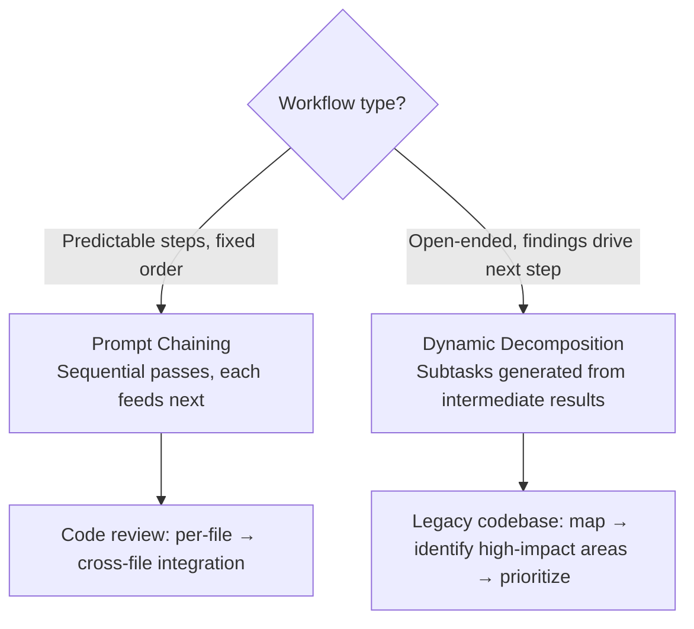

# Task Decomposition Patterns

Match the decomposition pattern to whether the workflow has predictable fixed steps (prompt chaining) or findings-driven dynamic steps (adaptive decomposition).

### Key Concepts



| Pattern | Use when | Mechanism |
|---|---|---|
| **Prompt chaining** | Predictable multi-step, fixed order | Sequential passes; each step's output feeds the next |
| **Dynamic decomposition** | Open-ended investigation, findings drive next step | Generate subtasks based on intermediate results |

- Single-prompt multi-step tasks exceed reliable attention span — quality degrades on later steps when the model must track too many distinct transformation goals simultaneously
- Each step in a prompt chain should have verifiable intermediate output before proceeding
- Run fixed steps in parallel where output order doesn't matter (e.g., per-file analysis)
- Some tasks look chainable but their shape (which subtasks first, at what depth) can only emerge during execution — e.g., "add tests to a legacy codebase"

### How to

#### Fixed pipelines (prompt chaining)

Each step is defined in advance:

```
Document → Metadata extraction → Data extraction → Validation → Enrichment → Final output
```

```
Invoice pipeline:
Step 1: Extract line items per invoice (parallel, one prompt per doc)
Step 2: Normalize currencies and dates across all extractions
Step 3: Aggregate totals, flag anomalies
Step 4: Generate summary report
```

Use when the task structure is predictable, all steps are known up front, and you need stability and reproducibility.

#### Dynamic adaptive decomposition

Subtasks are generated based on intermediate results:

```
1. "Add tests for a legacy codebase"
2. → First: map the structure (Glob, Grep)
3. → Found: 3 modules with no tests, 2 with partial coverage
4. → Prioritize: start with the payments module (high risk)
5. → During work: discovered a dependency on an external API
6. → Adapt: add a mock for the external API before writing tests
```

Use when the full scope is unknown up front and each step depends on the results of the previous step.

### Anti-patterns

- Cramming all transformation steps into one prompt — attention dilutes across distinct transformation goals, and you lose verifiable intermediate output to inspect or replay
- Using an agent loop when steps are fixed and sequential — adds overhead and non-determinism
- Using prompt chaining for open-ended tasks where the next step depends on what was found
- Chaining a workflow whose shape you don't know yet — locks in the wrong stages, hard-coded
- Using dynamic decomposition on a known pipeline — costs more and is harder to debug
- **Over-decomposition** — splitting into 10+ hyper-specialized subagents (header-extractor, footer-extractor, font-analyzer, table-detector, image-classifier…) multiplies latency, cost, and failure points. Each hop must justify its orchestration cost; if two specialists could be one subagent with two tools, collapse them. Aim for a moderate number of subagents (3–4) with 4–5 scoped tools each

### Problem: Multi-step workflow handled as single prompt

**Scope:** `cross-cutting`

**Problem statement:** A pipeline that extracts, normalizes, aggregates, and reports on invoice data in a single prompt produces inconsistent results — some steps done well, others skipped or shallow depending on the run.

**Root cause:** The model must track too many distinct transformation goals simultaneously, causing quality to degrade on later steps.

**Key decision:** Single prompt vs prompt chaining vs full agent loop vs parallel subagents.

**Solution:** Prompt chaining — decompose into sequential focused prompts where each step's output feeds the next. Use when steps are known upfront and each step has verifiable intermediate output.

### Use case: Choose the Pattern

For each task, choose prompt chaining or dynamic decomposition. Justify.

1. Security review of a PR touching 12 files — check each file for known vulnerability patterns, then check cross-file data flows
2. "Investigate why our API latency spiked last Tuesday" — cause is unknown
3. Extract, normalize, and aggregate structured data from 500 invoices
4. "Add tests to a 50k-line legacy codebase with no existing test suite"

```python
# Prompt chaining — fixed pipeline, known stages (1, 3)
def security_review(pr):
    findings = [scan_file(f) for f in pr.files]   # fixed step 1
    return cross_file_flow_check(findings)        # fixed step 2

def invoice_pipeline(invoices):
    extracted  = [extract(i) for i in invoices]   # fixed
    normalized = [normalize(e) for e in extracted]
    return aggregate(normalized)

# Dynamic decomposition — unknown shape (2, 4)
def investigate(symptom):
    plan = agent.plan(symptom)                    # model decides sub-tasks
    while plan.has_open_questions:
        plan = agent.expand(plan)
    return plan.report

def add_tests(repo):
    plan = agent.scope(repo)                      # discovers what to test
    return agent.execute(plan, budget="iterative")
```

**Answers:** 1 → chaining · 2 → dynamic · 3 → chaining · 4 → dynamic.
