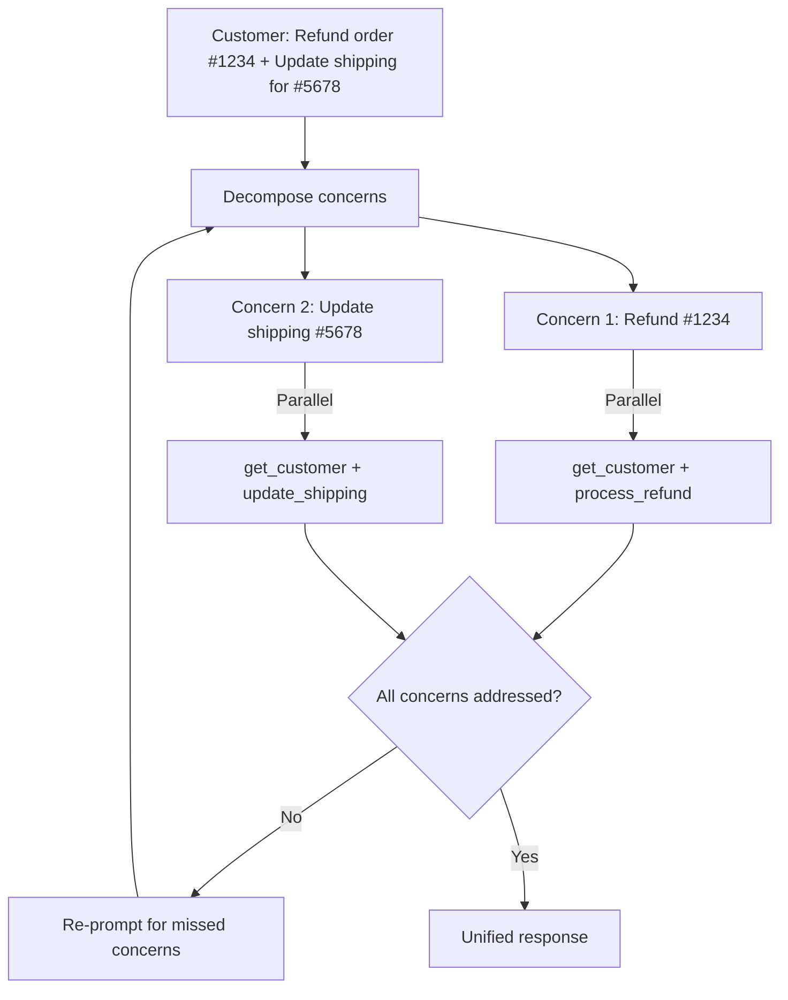

# Multi-Concern Request Handling

Decompose multi-concern requests into distinct items, investigate each in parallel, then synthesize a unified response.

### Key Concepts



- Investigate each concern independently and resolve in parallel — sequential resolution adds unnecessary latency
- Response validation detects incomplete responses and re-prompts for missed concerns — more reliable than preprocessing or few-shot examples alone
- Gather shared context (customer info, account state) once and reference it from all parallel investigations
- Concerns that look independent may interact (a refund changes the credit balance) — verify final account state once at the end

### How to

- Parse the request into a structured list of distinct items before routing
- Spawn parallel tool calls for independent concerns; only sequence when there is a data dependency
- Pass each parallel branch its required context explicitly — do not assume shared state
- Validate the reply covers every identified concern; re-prompt for any missing one before sending

### Anti-patterns

- Resolving independent concerns sequentially — doubles latency ❌
- Relying on the model to notice all concerns without explicit parsing ❌
- Sending a response without validating all concerns were addressed ❌
- Replying to the easiest concern first and forgetting the others — track an explicit `addressed_ids` set ❌
- Treating one concern as "low priority" leaves the customer feeling unheard; address every concern in *one* reply ❌

### Use case: Multi-Concern Decomposition

A customer sends: "I'd like a refund for order #1234 (damaged item), and can you also update the delivery address on order #5678 to 42 Main St? Also, why is my account showing a credit of €20?"

1. List the distinct concerns
2. Identify which can be investigated in parallel vs which have dependencies
3. Design the validation check that confirms all three concerns are addressed before sending the response

```python
concerns = [
  {"id": "refund_1234",   "kind": "refund",         "order": "1234", "reason": "damaged"},
  {"id": "address_5678",  "kind": "update_address", "order": "5678", "to": "42 Main St"},
  {"id": "credit_query",  "kind": "explain_credit", "amount": 20.00, "currency": "EUR"},
]

# All independent — run in parallel
results = parallel([
    process_refund(c)     if c["kind"] == "refund"
    else update_address(c) if c["kind"] == "update_address"
    else explain_credit(c)
    for c in concerns
])

def validate(reply, concerns):
    for c in concerns:
        assert c["id"] in reply.addressed_ids, f"missing: {c['id']}"
    return reply
```
