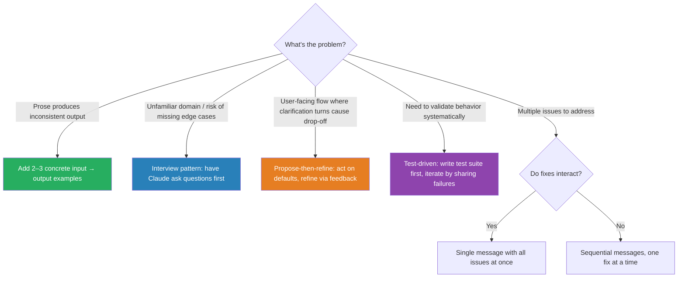

# Iterative Refinement Techniques

Use concrete examples, test-driven iteration, and the interview pattern to progressively improve outputs.

### Key Concepts



- **Input/output examples:** when prose is interpreted inconsistently, 2–3 concrete `input → output` pairs beat paragraphs of instructions
- **Interview pattern:** have Claude ask clarifying questions (cache invalidation, failure modes) before implementing in unfamiliar domains
- **Propose-then-refine:** in user-facing flows, lead with a concrete proposal built from contextual defaults; let the user correct it rather than answer pre-flight questions
- **Test-driven iteration:** write a test suite covering expected behavior, edge cases, and performance first; iterate by sharing failures
- Address **interacting** issues in a single message; fix **independent** issues sequentially. Conflicting fixes need to see each other; independent fixes attribute cleanly

#### The "interview" pattern

Before implementing, Claude asks clarifying questions:

```
Claude: "Before implementing caching for the API, a few questions:
1. Which cache invalidation strategy do you prefer—TTL or event-based?
2. Is stale data acceptable when the cache is unavailable?
3. Should caching be per-user or global?
4. What is the expected data volume to cache?"
```

Useful when:

- Unfamiliar domain (fintech, healthcare, legal systems)
- Tasks with non-obvious implications (cache strategies, failure modes)
- Multiple viable approaches where the best choice depends on context

#### The "propose-then-refine" pattern

The inverse of the interview pattern. Instead of front-loading clarifying questions, immediately produce a concrete proposal from sensible defaults and let the user correct it in-flight.

```
User: "Help me plan a birthday party."

Claude: "Here's a starting plan — tell me what to change:
 • Date: Saturday, Jun 6 (next free weekend)
 • Venue: mid-size restaurant, 20–30 guests
 • Budget: ~$800 (mid-range, food + drinks)
 • Theme: casual dinner with a cake reveal
What should I adjust?"

User: "Make it outdoors and bump to 40 people."
Claude: [revises proposal, keeps unchanged fields]
```

Why it works:

- **Eliminates upfront interrogation.** Multi-turn clarification (often 4+ questions) causes drop-off in conversational products; a concrete proposal delivers value on turn 1
- **Surfaces reasoning through the artifact.** Defaults are visible and correctable — unlike silent assumptions, which fail invisibly
- **Faster convergence than bundled questions.** Users react to concrete options more accurately than they answer abstract ones ("$800" is easier to react to than "what's your budget?")

Useful when:

- Consumer/assistant flows where turn count directly impacts retention
- Domains with strong contextual defaults (dates, sizes, price tiers, common configurations)
- Tasks where the user recognizes the right answer faster than they can specify it

Pair with the interview pattern when stakes are high: propose first, then ask only the question whose answer would materially change the proposal.

### How to

- **Course-correct early.** `Esc` to stop, type the correction, continue. Interrupting is cheap vs letting drift accumulate
- **After two failed corrections, `/clear` and re-prompt** with what you learned. Fresh context with a better prompt beats compounding confusion in a stuck session

### Anti-patterns

- Adding more prose instructions when format is inconsistent — examples fix this ❌
- Implementing in unfamiliar domains without surfacing edge cases first ❌
- Front-loading 3+ clarifying questions in user-facing flows — propose a default first, refine from there ❌
- Acting on silent assumptions in a user-facing flow — surface them as a visible proposal the user can correct ❌
- Fixing interacting issues in separate sequential messages — fixes may conflict ❌
- Fixing independent issues in one large message — harder to attribute which fix resolved which problem ❌
- Plan-then-execute on a familiar problem just adds latency ❌
- Error-driven loops without a max-iteration cap can run forever on an unfixable bug ❌
- Segmented routing means *more pipelines to maintain* — only do it when accuracy on the hard segment matters ❌

### Use case: Choose the Technique

For each situation, choose the best iterative refinement technique:

1. A code formatter produces inconsistent indentation despite a detailed style guide in the prompt
2. You need to implement a distributed cache — you haven't worked with this system before
3. A migration script fails on null values; you have 12 other issues to fix as well
4. An extraction pipeline works on most invoices but fails on handwritten forms

```python
# 1 — replace prose with few-shot examples
prompt = STYLE_GUIDE + "\n\n## Examples\n" + few_shot_examples

# 2 — plan-then-execute (knowledge gap → model lays out the design first)
plan = agent.plan("Implement distributed cache with TTL + LRU eviction")
review_plan(plan)
agent.execute(plan)

# 3 — error-driven loop, batch the fixes
for issue in collect_issues(script):
    fix = agent.fix(script, issue)
    apply(fix)
    re_run(script)

# 4 — segment by failure mode, specialise the hard segment
if doc.handwritten:
    return ocr_pipeline(doc) → extract(doc)   # different pipeline entirely
return extract(doc)
```

**Suggested answers:** 1 → few-shot · 2 → plan-then-execute · 3 → error-driven · 4 → segmented routing.
