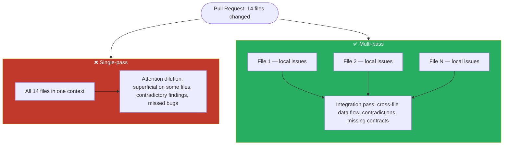

# Multi-Pass Review

Split large reviews into focused passes to avoid attention dilution — and always use an independent instance, never self-review.

### Key Concepts



- **Self-review limitation:** the session that generated code won't question its own reasoning. Use an independent instance with no shared context.
- **Multi-pass:** per-file local passes catch local issues at consistent depth; a separate cross-file integration pass catches data flow issues and contract violations.
- **Consensus anti-pattern:** "flag only if 2/3 runs agree" suppresses intermittently detected real bugs.
- **De-duplication:** pass prior findings in context; instruct the model to report only new or unaddressed issues.
- **Finding identity:** fingerprint by `(file, line, rule_id, snippet_hash)` — line-only de-dup misses re-orderings.

### How to

- Run verification passes where the model self-reports confidence per finding to route human review.
- Pass *summaries* (not raw findings) into the integration pass; link to detail on demand.

```typescript
// Verification with calibrated routing — confidence thresholds drive next step
const findings = await review(diff);
for (const f of findings) {
  if (f.confidence < 0.6)       f.route = "discard_or_human";
  else if (f.confidence < 0.85) f.route = "secondary_review";
  else                          f.route = "auto_apply";
}

// Independent instance (no generation context) catches more
const fresh = new Anthropic({ apiKey });
const independent = await fresh.messages.create({
  messages: [{ role: "user", content: `Review:\n${draft}` }],
});
```

#### Pass structure for large PRs

For pull requests with 10+ files:

```
Pass 1 (per-file): Analyze auth.ts → list local issues
Pass 1 (per-file): Analyze database.ts → list local issues
Pass 1 (per-file): Analyze routes.ts → list local issues
...
Pass 2 (integration): Analyze relationships between files
  → Cross-file issues: inconsistent types, circular dependencies
```

### Anti-patterns

- Reviewing with the same instance that generated the code — reasoning bias is retained ❌
- Single-pass review of 10+ files — attention dilutes, findings become inconsistent ❌
- Consensus voting across 3 runs — suppresses real bugs caught intermittently ❌
- Requiring smaller PRs as the "fix" — shifts burden without improving the review system ❌
- Larger context window to fit everything — doesn't fix attention quality ❌
- Re-running the whole pipeline on every push — duplicates work; cache file-level results by content hash ❌

### Use case: Multi-Pass Design

A PR touches 20 files across authentication, payment processing, and notification modules. Your current single-pass review misses cross-service contract violations.

Design a multi-pass review architecture:

- How many passes, and what does each analyze?
- How does the integration pass receive per-file results?
- How do you de-duplicate findings on subsequent commits?

```python
def multi_pass_review(pr):
    # Pass 1 — per-file, parallel, narrow lens
    file_findings = parallel([
        agent.review_file(f, lens="correctness+security+style") for f in pr.files
    ])

    # Pass 2 — per-module, cross-file within the module
    module_findings = parallel([
        agent.review_module(m, file_findings_for(m)) for m in pr.modules
    ])

    # Pass 3 — cross-service contract check
    integration = agent.review_contracts(
        pr=pr, modules=module_findings,
        contracts=load_service_contracts(),
    )

    all_findings = file_findings + module_findings + integration

    # De-dup on subsequent commits — fingerprint by (file, line, rule_id, hash(snippet))
    return dedupe(all_findings, against=previous_review_for(pr.id))
```
