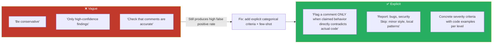
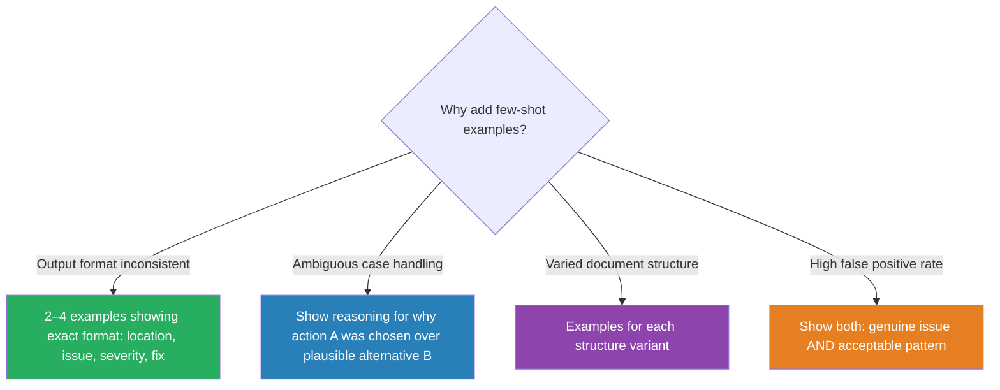

# Disambiguating Prompts

Model output variance has two sources: vague instructions ("be conservative") leave the model to guess interpretation, and genuinely ambiguous scenarios (mixed signals, novel patterns) defeat even explicit rules.

Address in order — write explicit categorical criteria first; add 2–4 few-shot examples for what the criteria can't fully pin down. Examples fix inconsistency that more prose cannot.

### Key Concepts



**Layer 1 — explicit categorical criteria**

- Vague words like "conservative", "thorough", or "high-confidence" carry no shared definition — the model falls back to its own judgment, which is inconsistent across runs and document types
- Model self-assessed confidence is poorly calibrated — confidence-based filtering is not a substitute for criteria
- High false positives in one category (e.g., security) undermine trust in accurate categories (e.g., logic bugs) — developers stop trusting all findings. Temporarily disable the high-FP category while iterating, rather than letting it poison trust everywhere
- Specific prompts turn the prompt into a directed search; vague ones force exploratory reads
  - **Vague:** *"Fix the login bug."* → forces Claude to guess intent and read more than needed
  - **Specific:** *"Users see a blank screen after wrong credentials. Check `src/auth/`, especially token refresh. Write a failing test, then fix."* → directed and verifiable

**Layer 2 — few-shot examples**

- Use 2–4 targeted examples for cases that explicit criteria can't fully pin down
- Examples sit in every request — keep each under ~6 lines or prompt cost balloons
- Show *reasoning*, not just labels — the model learns the judgment principle, not the surface pattern
- Pair a positive with a negative — contrasting examples teach the boundary; two examples of the same shape only teach that one shape
- Include explicit "no issue" and "ambiguous" output categories so the model can abstain instead of hallucinating a finding



| When to add few-shot | What each example shows |
|---|---|
| Output format inconsistent | Exact desired structure (location, issue, severity, fix) |
| Ambiguous case handling | Reasoning for why action A was chosen over plausible alternative B |
| Varied document structure | One example per variant |
| High false positive rate | Both a genuine issue and an acceptable pattern |
| Non-standard units / informal phrasing | The mapping (e.g., "two handfuls" → ~100g) |

### How to

- Define which specific issues to report vs skip (bugs + security, not minor style or local patterns)
- Include concrete code examples for each severity level to achieve consistent classification
- State scope explicitly when narrow: *"Only modify `src/auth/`. Do not refactor unrelated files."*
- Test criteria against known positives and known negatives before deploying
- When criteria still produce inconsistency, add 2–4 few-shot examples — pair every positive ("DO flag") with a negative ("DO NOT flag")
- Include explicit `NONE` / `UNCLEAR` output categories so the model can abstain
- Pair examples with normalization rules in the prompt (dates → ISO 8601, currency → numeric + code, percentages → decimal fraction) to prevent semantic errors where JSON is syntactically valid but values are inconsistent
- Use `tool_choice` forced selection to eliminate output-syntax errors

```markdown
# Vague (interpreted inconsistently)
Check code comments for accuracy.
Be conservative—report only high-confidence findings.

# Explicit (categorical criteria)
Flag a comment as problematic ONLY if:
1. The comment describes behavior that CONTRADICTS the actual code behavior
2. The comment references a non-existent function or variable
3. A TODO/FIXME refers to a bug that has already been fixed in code

Do NOT flag:
- Comments that are merely stylistically outdated
- Comments with minor wording inaccuracies
- Missing comments (separate category)
```

```markdown
# Severity criteria with examples
CRITICAL: Runtime failure for users
  Example: NullPointerException while processing a payment
HIGH: Security vulnerability
  Example: SQL injection, XSS, missing authorization checks
MEDIUM: Logic bug without immediate impact
  Example: Wrong sorting, off-by-one error
LOW: Code quality
  Example: Duplication, suboptimal algorithm for small data
```

**Ambiguous scenarios** — show why one action was chosen over a plausible alternative:

```
Request: "My order is broken"
Action: get_customer → lookup_order → check status.
Rationale: "broken" may mean a damaged item; you need order details.

Request: "Get me a manager"
Action: Immediately call escalate_to_human.
Rationale: Customer explicitly requests a human. Do not attempt to solve.
```

**Output formatting** — show the exact desired structure:

```json
{
  "location": "src/auth/login.ts:42",
  "issue": "SQL injection in the username parameter",
  "severity": "critical",
  "suggested_fix": "Use a parameterized query"
}
```

**Acceptable vs problematic** — both lenses:

```javascript
// Acceptable (do not flag):
const items = data.filter(x => x.active);

// Problem (flag):
const items = data.filter(x => x.active == true); // Use strict equality ===
```

**Severity dimension with explicit `NONE` and `UNCLEAR`** — gives the model a principled way to abstain:

```typescript
// Example 1 (clear case):
//   Input:  "useState in render loop, src/Foo.tsx:23"
//   Output: { file: "src/Foo.tsx", line: 23, severity: "HIGH",
//             fix: "Hoist useState above the loop" }

// Example 2 (ambiguous — show how to handle):
//   Input:  "performance might be slow somewhere"
//   Output: { severity: "UNCLEAR", note: "No location specified — request a repro" }

// Example 3 (acceptable pattern, NOT a real issue):
//   Input:  "Component re-renders when props change"
//   Output: { severity: "NONE", note: "Expected React behavior" }
```

**Informal measurements** — few-shot is especially effective for non-standard units:

```
"about two handfuls of rice" → {"amount": "~100g", "precision": "approximate"}
"a pinch of salt"            → {"amount": "~1g",   "precision": "approximate"}
```

**Format normalization rules** — pair with examples in the prompt:

```
- Dates: always ISO 8601 (YYYY-MM-DD); "yesterday" → compute an absolute date
- Currency: numeric amount + currency code; "five bucks" → {"amount": 5, "currency": "USD"}
- Percentages: decimal fraction; "half" → 0.5
```

### Anti-patterns

- "Be conservative" or "be thorough" — interpreted inconsistently, not actionable ❌
- "Only report high-confidence findings" — model self-confidence is poorly calibrated ❌
- Leaving high-FP categories enabled while iterating — destroys trust in all findings ❌
- Confidence-based filtering in place of specific categorical criteria ❌
- Flagging ORM calls — they look stringy but bind by default, producing the bulk of false positives ❌
- Adding more descriptive prose when inconsistency is the problem — examples fix this, more prose doesn't ❌
- Using 10–15 examples when 2–4 suffice — diminishing returns, token overhead ❌
- Examples for obvious, unambiguous cases — wastes the example slot on what the model already handles ❌
- Examples without inline reasoning (bare label "not an issue") — model learns the output, not the judgment principle ❌
- Two examples both showing the same shape — pick contrasting cases that span the decision boundary ❌

### Problem: SQL injection at 60% false positives

**Scope:** `api` · `claude-code`

**Problem statement:** A code review prompt says *"Flag security issues conservatively."* Production data shows 60% false positives on SQL injection findings, causing developers to distrust all review output.

**Root cause:** *"Conservatively"* doesn't define which patterns to flag vs skip. The model falls back to its own judgment, which is inconsistent across runs and document types.

**Key decision:** Explicit categorical criteria vs few-shot examples vs confidence threshold vs disable category. (The answer is *layered*: criteria first, then few-shot for what criteria can't capture.)

**Solution — Layer 1: explicit criteria**

```markdown
## SQL injection — flag only if ALL apply

1. Untrusted input (request body/query/header, file content, third-party API) reaches the SQL string.
2. The input is **string-concatenated or interpolated** into SQL — not bound as a parameter.
3. The query runs against a real database driver (not a logger, not an ORM `.where({})` call).

DO flag:
    db.query("SELECT * FROM users WHERE id = " + req.params.id)

DO NOT flag:
    db.query("SELECT * FROM users WHERE id = $1", [req.params.id])   # bound
    logger.info(`SQL: SELECT * FROM users WHERE id=${id}`)           # not executed
    User.findOne({ where: { id: req.params.id } })                   # ORM-bound
```

**Solution — Layer 2: paired few-shot examples**

```markdown
### Example 1 — genuine issue
Code:
    db.query("SELECT * FROM users WHERE email = '" + req.body.email + "'")
Finding: SQL injection.
Reasoning: `req.body.email` is untrusted, concatenated into SQL, executed by the driver.

### Example 2 — not an issue
Code:
    User.findAll({ where: { email: req.body.email } })
Finding: none.
Reasoning: Sequelize binds `email` as a parameter; no string concatenation reaches the driver.
```

### Use case: Few-shot for format variance

**Problem statement:** Extraction produces `null` for `invoice_date` across all documents even when dates are present in varied formats (ISO 8601, written-out, inline vs header vs footer position).

**Root cause:** Model cannot generalize date extraction across varied formats without concrete examples showing each variant.

**Key decision:** Add few-shot examples vs add retry logic vs loosen schema.

**Solution:** Add few-shot examples demonstrating correct extraction from each format variant. Use `tool_choice` forced selection to eliminate syntax errors.

**Anti-pattern:** Adding retry logic without examples (retries the same failing pattern); loosening schema to `string` without format constraint (accepts garbage values).
