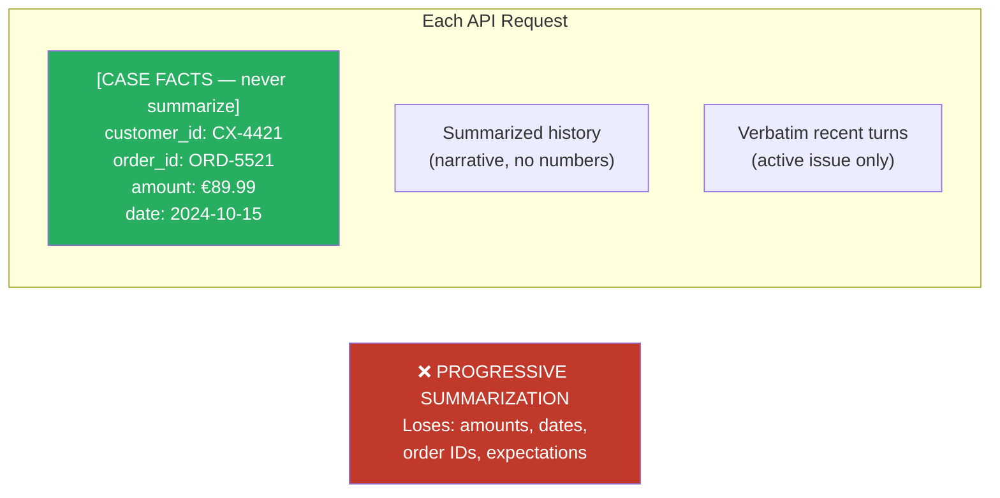

# Context Management

Long inputs and long sessions fail in three distinct ways: middle positions get less attention than ends (lost-in-the-middle), summarization erodes verbatim facts (numbers, IDs, dates), and accumulated tool output drowns out coordination context.

 A larger context window delays each failure but resolves none of them — manage actively via layout, extraction, delegation, and compaction.

### Key Concepts

**Positional attention (lost-in-the-middle)**

- Models reliably process information at the **beginning and end** of long inputs — middle sections are attended to less reliably, especially past 20K tokens. Distinct from summarization loss: it occurs even when content is fully present, due to position alone
- **Single-turn vs across-turn salience:** end placement is high salience *this* turn, but next turn's appended content pushes it into the middle. Beginning anchors (system prompt, scratchpad reinjection) survive turn rotation

**Summarization loss**

- Summarization optimizes for brevity — specifics compress into generalities unusable for downstream decisions ("discussed promotional pricing" loses the specific 15% discount)
- Models cannot reliably "prompt their way out" of information already lost in summarization
- Amounts, IDs, dates, percentages must always be kept verbatim — a summary that says "around €90" is wrong by enough to matter
- Promise claims like "I was told" need a turn reference (e.g., `promised_at_turn`) — the agent will need to verify the claim later
- Free-text complaints can be summarized, but keep the original turn number for grounding



**Session-level degradation**

- **Symptoms:** inconsistent answers, referencing "typical patterns" instead of specific discovered classes, contradicting earlier findings
- **Instruction drift:** as conversation grows, the model attends more to recent turns (especially its own prior outputs) than to the original system prompt. Drift can appear well inside the token limit, once accumulated assistant text outweighs the system prompt
- Tool results accumulate disproportionately to relevance (40+ fields per order lookup when only 5 matter)
- **One concrete deliverable per investigation** — unscoped "look around" sessions fill context with nothing to show for it
- **One concern per session** — refactoring + debugging + doc updates in one session ends with incoherent context

##### What loads at session start

| Block | Loaded | Cost |
|---|---|---|
| System prompt | Always | ~4k tokens (hidden) |
| `CLAUDE.md` (all levels) | Always, in full | Whatever the file is |
| Auto memory `MEMORY.md` | First 200 lines / 25KB | Small — kept concise on purpose |
| `.claude/rules/*.md` | Always (unless `paths:` frontmatter) | Each file's content |
| Skill **descriptions** | Always | Tiny per skill |
| Skill **bodies** | On invocation only | Variable |
| MCP **tool names** | Always | Tiny |
| MCP **tool schemas** | On demand (tool search) | Variable |
| Environment + git status | Always | ~280 tokens |

Keep the *always-loaded* layer small. Push variable cost (skill bodies, MCP schemas) to on-demand loading.

##### Context-window management commands

| Command | What it does |
|---|---|
| `/context` | Show exactly what's currently using context, by category |
| `/clear` | Wipe history; restart with fresh context (CLAUDE.md re-loads) |
| `/compact [focus]` | Summarize older history; optional focus instructions |
| `Esc Esc` or `/rewind` | Restore conversation/code to a checkpoint |
| `/btw` | Ask a side question without polluting history |

##### What survives `/compact`

- **Root `CLAUDE.md` is re-injected from disk** — survives intact
- **Key code/decisions are preserved** by the summary, but lossy
- **Nested `CLAUDE.md` files** reload only when Claude re-reads files in their directory
- **In-conversation rules can be lost** — if you said "don't touch the `legacy/` folder" mid-session and `/compact` runs, that instruction may not survive. Move it to `CLAUDE.md` first, or pass `/compact preserve the rule about not touching legacy/`

##### Common context killers

- Reading large files (especially `package-lock.json`, generated code, minified bundles)
- Verbose command output (`npm install`, full test runs, large `find` results)
- Multi-file investigations done in the main session instead of via a subagent

### How to

- Extract transactional facts (amounts, dates, order numbers, statuses) into a `<case_facts>` block in the system prompt — never include in summarized history
- Place key findings summaries at the **beginning** of aggregated inputs; use explicit section headers to guide attention
- Use scratchpad files so key findings survive context compression — inject fresh at the start of each turn, re-read after `/compact`
- Trim verbose tool outputs to relevant fields before they push critical content into the middle (use a `PostToolUse` hook when the same tool keeps returning bloat)
- Spawn subagents for verbose discovery tasks — main agent receives summaries only, preserving coordination context
- Include metadata (dates, source locations, methodological context) in subagent outputs to support accurate downstream synthesis
- **Periodic re-injection** of load-bearing constraints: insert a user-role message (or fresh system message) restating the rules every N turns, at conversation breakpoints, or right after `/compact`. Re-injection re-establishes constraints without discarding continuity
- `/clear` between unrelated tasks (refactor → debug → docs is three sessions, not one); `/compact <focus>` for long sessions where the conversation matters; `/context` to inspect bloat before deciding which lever to pull
- Constrain subagent context budgets: send minimal context (task + necessary data), instruct return of structured results, use `allowedTools` to limit toolset

```python
system_prompt = f"""
You are a customer support agent.

<case_facts>
Customer ID: {customer_id}
Order ID: {order_id}
Stated issue: {issue_summary}
Amounts: refund_requested={refund_amount}, order_total={order_total}
</case_facts>

Conversation summary:
{compressed_history}
"""
# case_facts is OUTSIDE summarized history — never compressed
```

```python
# Scratchpad: agent writes findings to file; injected fresh on each turn
json.dump({"findings": findings}, open(".claude/scratchpad.json", "w"))
prompt = f"Prior findings:\n{open('.claude/scratchpad.json').read()}\n\nNext: {task}"
```

```python
# Trim a chatty tool result at the hook layer so every subsequent turn sees the lean version
@hook("PostToolUse", tool="lookup_order")
def trim_order_fields(result):
    return {
        "order_id":        result["order_id"],
        "status":          result["status"],
        "total":           result["total"],
        "items":           result["items"],
        "return_eligible": result["return_eligible"],
    }
```

```
Main agent: "Investigate dependencies of the payments module"
  → Subagent (Explore): reads 15 files, traces imports
  → Returns: "Payments depends on AuthService, OrderModel, and the external PaymentGateway API"

Main agent: keeps one line in context instead of 15 files
```

### Anti-patterns

- Summarizing transactional data (amounts, dates, IDs) into narrative — exact numbers cannot be recovered from a summary ❌
- Passing all 40 fields from a tool response when only 5 are relevant ❌
- Increasing the context window as the fix — delays but does not resolve degradation ❌
- Running verbose exploration in the main agent context — delegate to a subagent ❌
- Relying on subagent summaries when exact line numbers or signatures are needed — ask for them in the brief ❌
- Letting scratchpads grow unbounded — periodically prune to "still-relevant findings" ❌
- No crash recovery mechanism — state is lost if a long-running agent is interrupted ❌
- Relying on document insertion order — the model does not attend uniformly across positions ❌
- Placing IDs, amounts, or the current question in the middle — that is where attention dips ❌
- Pinning durable invariants only at the end of a turn — they slide into the middle as the conversation grows. Anchor across turns at the **beginning** ❌
- Letting `/compact` touch verbatim canonical records (`<case_facts>` with IDs, amounts, dates) — they are not summaries ❌

### Problem: Critical facts missed due to position or compression

**Scope:** `cross-cutting`

**Problem statement:** The agent misses or underweights critical numerical values (amounts, IDs, dates) — either because they sit in the middle of a long context, or because progressive summarization has flattened them into narrative.

**Key decision:** Reorder layout vs extract to `<case_facts>` vs trim tool outputs vs delegate to subagent vs `/compact` with focus.

**Solution:** Place the most critical facts at the very start (durable) and just before the current question (recency); keep them verbatim outside the summarized region; isolate verbose exploration in subagents; protect canonical records from `/compact`.

### Use case: Single-turn context layout

Inputs for a single API request (sizes approximate):

- System prompt: 2K tokens
- Customer case facts (amounts, dates, order IDs): 1K tokens
- Conversation history (summarized): 8K tokens
- Tool result from `get_order` (40 fields): 3K tokens
- Tool result from `search_policy` (full text): 10K tokens
- Current question: 500 tokens

Reorder and trim. What stays verbatim? What gets trimmed?

```text
[ System prompt — 2K  ]                            ← anchor (top)
[ Conversation summary — 8K, can be lossy ]        ← middle (tolerable loss)
[ search_policy — trim to ~2K relevant excerpts ]  ← middle (trim aggressively)
[ get_order — keep 8 fields the question needs ]   ← middle (project)
[ <case_facts> verbatim — IDs, amounts, dates ]    ← near end (high salience)
[ Current question — 500 ]                         ← last position (recency)
```

```python
messages = [
    {"role": "system",    "content": SYSTEM},
    {"role": "user",      "content": history_summary},
    {"role": "tool",      "content": policy_excerpts},      # trimmed
    {"role": "tool",      "content": order_subset},         # projected
    {"role": "user",      "content": f"<case_facts>\n{facts}\n</case_facts>"},
    {"role": "user",      "content": question},
]
```

### Use case: Case-facts extraction across turns

A customer support conversation contains:

- Turn 3: "I paid €89.99 for order #ORD-5521 on October 15th"
- Turn 12: "I was told I'd get 15% off my next order"
- Turn 18: "The item arrived damaged"

Design the `<case_facts>` block that persists outside summarization. Which fields stay verbatim? Which can be summarized?

```xml
<case_facts>
  <!-- VERBATIM — losing precision = wrong action -->
  <order id="ORD-5521" amount="89.99" currency="EUR" paid_date="2024-10-15"/>
  <promised_discount percentage="15" scope="next_order" promised_at_turn="12"/>

  <!-- SUMMARIZABLE — qualitative, not action-driving -->
  <complaint>Item arrived damaged (turn 18).</complaint>
</case_facts>
```

### Use case: Long agentic session

A codebase exploration session has been running for 45 minutes. The main agent has read 30 full files into context verbatim, accumulated 12 tool call responses (~2K tokens each), and lost track of which classes it found in the first 20 minutes. Design a strategy.

```markdown
## Strategy

1. **Scratchpad first.** Maintain `notes/exploration.md` with discovered classes,
   their files, and one-line summaries. Append after every new finding.
2. **Delegate verbose reads.** Send file-walks to an Explore subagent;
   keep only the summary in main context.
3. **Compact at thresholds.** Run `/compact` at ~120K tokens; protect
   `notes/exploration.md` from compaction by re-reading it after.
```

```python
def explore(question):
    if context_tokens() > 120_000:
        run("/compact")
        reread("notes/exploration.md")           # restore key facts

    summary = subagent("Explore", question)      # verbose work isolated
    append("notes/exploration.md", summary)
    return summary
```
