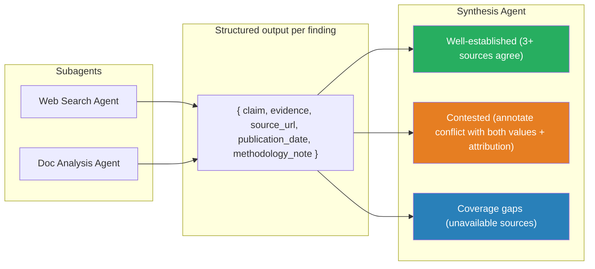

# Information Provenance

Require structured claim-source mappings from subagents — provenance lost during summarization cannot be recovered after the fact.

### Key Concepts



- Subagents must return structured claim-source mappings: `{ claim, source_url, document_name, publication_date, excerpt }`
- Conflicting statistics from credible sources: annotate both values with attribution — never silently select one
- Temporal differences (different publication dates) are not contradictions — include dates to distinguish
- Coverage gaps: report which source areas were unavailable rather than omitting
- Structure synthesis output: well-established, contested, coverage gaps
- Inject retrieved source documents at query time; enforce per-claim citation in the system prompt

```python
system = (
    "Answer using only the documents provided. "
    "Cite the source document name for each factual claim. "
    "If the documents lack the answer, say so — do not guess."
)
```

#### Attribution loss problem

When summarizing results from multiple sources, the "claim → source" link can be lost:

```
Bad: "The AI music market is estimated at $3.2B." (No source, no year.)

Good:
{
  "claim": "The AI music market is estimated at $3.2B.",
  "source_url": "https://example.com/report",
  "source_name": "Global AI Music Report 2024",
  "publication_date": "2024-06-15",
  "confidence": 0.9
}
```

#### Handling conflicting data

Preserve both values with attribution and let the coordinator decide:

```json
{
  "claim": "Share of AI-generated music on streaming platforms",
  "values": [
    { "value": "12%", "source": "Spotify Annual Report 2024",
      "date": "2024-03", "methodology": "Automated classification" },
    { "value": "8%",  "source": "Music Industry Association Survey",
      "date": "2024-07", "methodology": "Survey of 500 labels" }
  ],
  "conflict_detected": true,
  "possible_explanation": "Difference in methodology and time period"
}
```

#### Include dates for correct interpretation

Without dates, temporal differences are misinterpreted as contradictions:

```
Bad:  "Source A says 10%, source B says 15%. Contradiction."
Good: "Source A (2023) says 10%, source B (2024) says 15%. Likely +5% growth over a year."
```

#### Render by content type

Don't force everything into one format:

- Financial data → tables
- News and analysis → prose
- Technical findings → structured lists
- Time series → chronological ordering

```typescript
function render(item) {
  switch (item.type) {
    case "financial":  return renderTable(item);   // numbers want columns
    case "news":       return renderProse(item);   // narrative wants paragraphs
    case "technical":  return renderList(item);    // findings want bullets
  }
}
```

#### Resolve conflicts with structure, not silence

Separate the report into **stable**, **disputed**, and **needs review** buckets. For temporal mismatches, label the resolution explicitly:

```typescript
// Conflicts: ANNOTATE, don't silently pick a winner
const merged = {
  topic: "Q4 revenue",
  values: [
    { value: "$2.4B", source: "10-K filing",   date: "2026-02-15" },
    { value: "$2.6B", source: "press release", date: "2026-01-30" }, // earlier estimate
  ],
  resolution: "TEMPORAL — press release was preliminary; 10-K is final.",
  recommended: "$2.4B (most recent, audited)",
};

// Report structure: stable findings vs disputed ones vs needs-review
const report = {
  stable:        [/* well-corroborated claims */],
  disputed:      [/* claims with conflicting sources */],
  needs_review:  [/* low-confidence or single-source */],
};
```

### Anti-patterns

- Allowing subagents to return prose summaries — provenance is discarded
- Attempting to recover citations from summaries after the fact — provenance is already gone
- Silently selecting one value when sources conflict
- Treating temporal differences as contradictions
- Relying on model training knowledge for factual claims without source documents
- Averaging two regional numbers into a "global" figure is a fabrication, not a synthesis
- Dropping the source on the way through a pipeline = no audit trail when a number is challenged
- "Approximately" is a tell that the model is hedging an unsupported number — train against it

### Use case: Provenance Tracking

A synthesis agent receives:

- Source A (USPTO, 2024): "AI patent filings increased 35% year-over-year in 2023"
- Source B (EPO, 2024): "AI-related patents grew 22% in the EU in 2023"

The current report says: "AI patent filings grew approximately 28% globally in 2023."

What is wrong with this synthesis? Rewrite it correctly, preserving full provenance.

```markdown
## What's wrong
- "28%" is invented — neither source said that.
- "globally" is unsupported — USPTO is US-only; EPO is EU-only.
- Provenance is dropped: the reader can't verify either claim.

## Corrected synthesis
AI patent filings grew **35% year-over-year in the US in 2023** [USPTO, 2024].
In the EU, AI-related patents grew **22% in 2023** [EPO, 2024].
No single global figure can be derived from these two sources alone.
```

```python
# Structured form for downstream tools
{
  "claims": [
    {"region": "US", "metric": "AI patent filings YoY", "value": 0.35,
     "year": 2023, "source": "USPTO 2024"},
    {"region": "EU", "metric": "AI-related patents YoY", "value": 0.22,
     "year": 2023, "source": "EPO 2024"},
  ],
  "global_estimate": null
}
```
