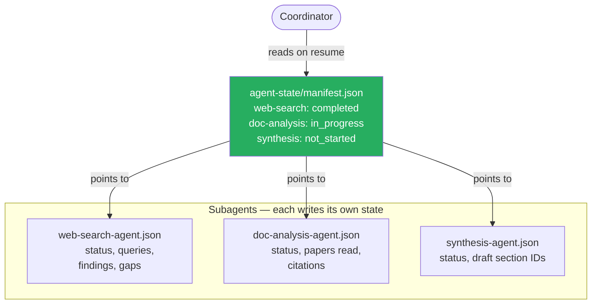

# Structured State Persistence

Each agent exports its progress to a known file location — coordinators recover by loading a manifest, not by replaying conversation history.

### Key Concepts



- **Crash recovery requires structured state on disk** — the model cannot reliably reconstruct prior progress from a chat log
- The manifest tells the coordinator what's done, in progress, and not yet started
- State files capture **decisions and findings**, not raw tool output — skip re-discovery on resume, do not mirror every byte
- Coverage gaps and unfinished queries belong in state files so a resumed coordinator picks up where it left off
- **Every state-changing tool call accepts an `idempotency_key`** — payments, credits, emails, ticket creation. The tool persists `(key → result)` on first execution and returns the stored result on any retry with the same key. The coordinator generates the key once per logical operation (e.g., `charge:order_123:attempt_1`) so retries are safe by construction. Without this, replay-after-crash double-charges customers, double-sends emails, and duplicates tickets

### How to

- Define a single state schema per agent type (status, inputs received, key findings, open gaps)
- Write state at meaningful checkpoints — after a successful tool batch, before delegation, on graceful shutdown
- Maintain a top-level `manifest.json` so the coordinator never scans the directory at resume time
- Treat state files as the **source of truth on resume**
- Add an `idempotency_key` parameter to every state-changing tool; persist `(key → result)` on first execution; on retry with the same key, return the stored result instead of re-executing

```json
// agent-state/idempotency.json — keyed log of state-changing operations
{
  "charge:order_123:attempt_1": {
    "executed_at": "2026-05-18T10:32:11Z",
    "result": { "charge_id": "ch_9f2a", "amount": 89.99 }
  }
}
```

```json
// agent-state/web-search-agent.json
{
  "status": "completed",
  "queries_executed": ["AI music 2024", "AI music composition"],
  "results_count": 12,
  "key_findings": [
    {"claim": "AI music market $3.2B in 2024", "source": "Global AI Music Report"}
  ],
  "coverage": ["music composition", "music production"],
  "gaps": ["music distribution", "music licensing"]
}
```

```json
// agent-state/manifest.json
{
  "web-search":   "completed",
  "doc-analysis": "in_progress",
  "synthesis":    "not_started"
}
```

### Anti-patterns

- Relying on conversation history for crash recovery — replay is unreliable and expensive ❌
- Writing raw tool output to state files — bloats disk and re-introduces noise on resume ❌
- Skipping the manifest — the coordinator must then scan and parse every state file on resume ❌
- Writing state only on graceful shutdown — crashes leave nothing to resume from ❌
- State-changing tool calls without an `idempotency_key` — replay-after-crash double-charges, double-sends, double-creates ❌
- Relying on a database transaction to cover external side effects (payments, emails, third-party API calls) — transactions roll back DB writes only ❌
